# Developer Documentation — PRISMA Review Agent

## Table of Contents

- [Architecture Overview](#architecture-overview)
- [Repository Layout](#repository-layout)
- [Module Responsibilities](#module-responsibilities)
- [Data Models](#data-models)
- [Pipeline Flow — Step by Step](#pipeline-flow--step-by-step)
- [Agent Architecture](#agent-architecture)
- [HTTP Clients & Caching](#http-clients--caching)
- [Data Storage & State Management](#data-storage--state-management)
- [PRISMA Flow Diagram — How It Works](#prisma-flow-diagram--how-it-works)
- [Design Decisions](#design-decisions)
- [Adding a New Agent](#adding-a-new-agent)
- [Environment & Configuration](#environment--configuration)

---

## Architecture Overview

The system is a **fully async Python pipeline** that automates PRISMA 2020 systematic literature reviews. It chains HTTP-based data acquisition (PubMed, bioRxiv) with LLM-powered analysis (screening, synthesis, risk of bias, etc.) using [pydantic-ai](https://docs.pydantic.dev/latest/integrations/pydantic_ai/) agents that return strongly-typed, validated outputs.

A **PostgreSQL cache layer** short-circuits the pipeline for repeated or highly-similar review requests (≥ 95% criteria similarity). A **source grounding validator** ensures every extracted evidence span is traceable back to actual article text.

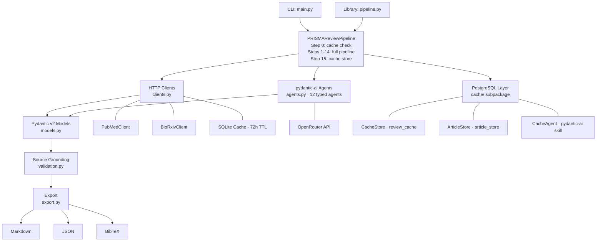

---

## Repository Layout

```
prisma-review-agent/
├── main.py               # CLI entry point (argparse)
├── pipeline.py           # Core async orchestrator (PRISMAReviewPipeline)
├── agents.py             # 12 pydantic-ai agents + runner functions
├── models.py             # All Pydantic v2 data models
├── clients.py            # HTTP clients: PubMedClient, BioRxivClient, Cache
├── evidence.py           # Evidence extraction + source grounding validation
├── validation.py         # Source grounding validator (rapidfuzz)
├── export.py             # to_markdown(), to_json(), to_bibtex(), to_enhanced_markdown()
├── __init__.py           # Root package (dev use)
├── prisma_review_agent/  # Installable package
│   ├── __init__.py       # Public API re-exports
│   ├── ontology/         # SLR Ontology integration — LinkML schema + RDF export
│   │   ├── __init__.py       # Re-exports to_turtle, to_jsonld
│   │   ├── slr_ontology.yaml # LinkML schema (v0.2.0, 1844 lines)
│   │   ├── slr_ontology.schema.json  # Generated JSON Schema
│   │   ├── slr_ontology.owl.ttl      # Generated OWL/Turtle
│   │   ├── namespaces.py     # rdflib.Namespace constants + URI-minting helpers
│   │   ├── rdf_export.py     # _build_graph(), to_turtle(), to_jsonld()
│   │   └── rdf_store.py      # SLRStore — pyoxigraph-backed SPARQL store
│   ├── cache/            # PostgreSQL cache sub-package
│   │   ├── __init__.py   # Package exports
│   │   ├── models.py     # CacheEntry, CacheLookupResult, SimilarityConfig, StoredArticle
│   │   ├── similarity.py # compute_fingerprint(), compute_similarity()
│   │   ├── store.py      # CacheStore — async PostgreSQL CRUD
│   │   ├── article_store.py  # ArticleStore — article persistence + full-text search
│   │   ├── skill.py      # pydantic-ai CacheAgent with @agent.tool tools
│   │   ├── admin.py      # list_entries(), inspect_entry(), clear_all()
│   │   └── migrations/
│   │       └── 001_initial.sql  # review_cache + article_store DDL
│   └── *.py              # (same modules as root)
├── pyproject.toml        # Build config, deps, entry point
└── developer.md          # This file
```

The `prisma_review_agent/` package is the installable form; root-level `.py` files are for direct development. Both contain the same code.

---

## Module Responsibilities

| Module | Responsibility | Key Types |
|---|---|---|
| `models.py` | All Pydantic v2 data models — no logic | `Article`, `ReviewProtocol`, `PRISMAFlowCounts`, `PRISMAReviewResult`, `EvidenceSpan`, `PrismaReview`, `ThematicSynthesisResult` (22 rich synthesis models added in 005) |
| `clients.py` | HTTP data acquisition + SQLite cache | `PubMedClient`, `BioRxivClient`, `Cache` |
| `agents.py` | LLM agent definitions + async runners | `AgentDeps`, 18 `Agent` instances, `run_*` functions. Rich synthesis agents: `abstract_section_agent`, `introduction_section_agent`, `thematic_synthesis_agent`, `quantitative_analysis_agent`, `discussion_section_agent`, `conclusion_section_agent` |
| `pipeline.py` | Async orchestrator — calls clients, agents, cache; hosts plan confirmation checkpoint (step 1a), `_build_review_plan()` helper, and rich synthesis assembly. `assemble_prisma_review()` runs a two-wave `asyncio.gather` to build the full `PrismaReview` object; `_assemble_methods()` and `_assemble_extracted_studies()` are deterministic helpers (no LLM). `_backfill_plain_text_fields()` preserves backward compat. | `PRISMAReviewPipeline.run(progress_callback, data_items, auto_confirm, confirm_callback, max_plan_iterations, output_synthesis_style)` |
| `evidence.py` | Evidence extraction + source grounding gate | `extract_evidence()` |
| `validation.py` | Source grounding validator — rapidfuzz matching | `filter_grounded()`, `validate_grounding()`, `ValidationReport` |
| `export.py` | Output formatters with cache provenance | `to_markdown()`, `to_json()`, `to_bibtex()`, `to_turtle()`, `to_jsonld()`, `to_oxigraph_store()` |
| `main.py` | CLI argument parsing + `ReviewProtocol` construction; `_cli_confirm()` callback for interactive plan confirmation; `--auto` / `--max-plan-iterations` flags | `main()`, `run_review()`, `_cli_confirm()` |
| `ontology/namespaces.py` | RDF namespace constants + URI-minting helpers | `SLR`, `PROV`, `DCTERMS`, `FABIO`, `BIBO`, `OA`; `article_uri()`, `review_uri()`, `bind_namespaces()` |
| `ontology/rdf_export.py` | rdflib graph construction + Turtle / JSON-LD serialization | `_build_graph()`, `to_turtle()`, `to_jsonld()`, `_add_charting()`, `_add_rob()`, `_add_evidence_spans()` |
| `ontology/rdf_store.py` | pyoxigraph-backed SPARQL store | `SLRStore.load()`, `.query()`, `.save()`, `.load_from_file()` |
| `cache/models.py` | Cache-specific Pydantic models + exceptions | `CacheEntry`, `CacheLookupResult`, `SimilarityConfig`, `StoredArticle` |
| `cache/similarity.py` | SHA-256 fingerprinting + weighted fuzzy scoring | `compute_fingerprint()`, `compute_similarity()` |
| `cache/store.py` | PostgreSQL async CRUD for review results | `CacheStore` |
| `cache/article_store.py` | PostgreSQL article persistence + tsvector search | `ArticleStore` |
| `cache/skill.py` | pydantic-ai CacheAgent with typed tool decorators | `cache_agent`, `cache_lookup()`, `cache_store()` |
| `cache/admin.py` | Developer utilities — inspect/list/clear cache | `list_entries()`, `inspect_entry()`, `clear_all()` |

---

## Data Models

### Core Model Relationships


### LLM Output Models (agent → Pydantic)

| Agent | Output Model | Key Fields |
|---|---|---|
| `search_strategy_agent` | `SearchStrategy` | `pubmed_queries[]`, `biorxiv_queries[]`, `mesh_terms[]`, `rationale` |
| `screening_agent` | `ScreeningBatchResult` | `decisions[ScreeningDecision]` → `index, decision, reason, relevance_score` |
| `rob_agent` | `RiskOfBiasResult` | `assessments[RoBDomainAssessment]`, `overall: RoBJudgment`, `summary` |
| `data_extraction_agent` | `StudyDataExtraction` | `study_design`, `sample_size`, `outcomes[]`, `key_findings[]`, `effect_measures[]` |
| `synthesis_agent` | `str` | Full narrative synthesis in Markdown |
| `grade_agent` | `GRADEAssessment` | `domains{}, overall_certainty: GRADECertainty`, `summary` |
| `bias_summary_agent` | `str` | Overall bias narrative |
| `limitations_agent` | `str` | Limitations section (2–3 paragraphs) |
| `evidence_extraction_agent` | `BatchEvidenceExtraction` | `articles[ArticleEvidenceExtraction]` → `evidence[ExtractedEvidenceItem]` |

---

## Pipeline Flow — Step by Step

`PRISMAReviewPipeline.run()` in [pipeline.py](pipeline.py) executes up to 16 steps. Step 0 is the PostgreSQL cache gate (short-circuits the pipeline on a hit). Steps 1–13 are sequential; step 14 runs three tasks in parallel via `asyncio.gather()`; step 15 persists the result to cache.


### Batch Sizes

| Step | Batch Size | Reason |
|---|---|---|
| Title/Abstract screening | 15 articles | Balance token cost vs. context length |
| Full-text screening | 10 articles | Larger input per article (up to 12k chars) |
| Evidence extraction | 5 articles | Highest per-article token cost; accuracy matters |
| PubMed efetch | 50 PMIDs | NCBI recommended limit |
| Full-text PMC fetch | 10 articles | Rate limit + response size |

---

## Agent Architecture

All agents follow the same pattern: declared once as a module-level constant, model injected at call time via `build_model()`.

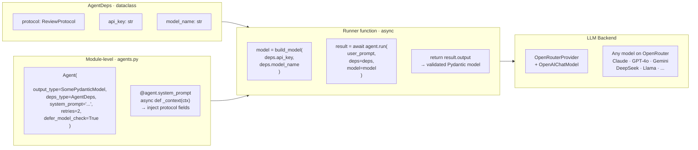

### Agent Map

| # | Agent | Runner | Output |
|---|---|---|---|
| 1 | `search_strategy_agent` | `run_search_strategy(deps)` | `SearchStrategy` |
| 2 | `screening_agent` | `run_screening(articles, deps, stage)` | `ScreeningBatchResult` |
| 3 | `rob_agent` | `run_risk_of_bias(article, deps)` | `RiskOfBiasResult` |
| 4 | `data_extraction_agent` | `run_data_extraction(article, items, deps)` | `StudyDataExtraction` |
| 5 | `data_charting_agent` | `run_data_charting(article, deps)` | `DataChartingRubric` |
| 6 | `critical_appraisal_agent` | `run_critical_appraisal(article, rubric, deps)` | `CriticalAppraisalRubric` |
| 7 | `narrative_row_agent` | `run_narrative_row(rubric, appraisal, deps)` | `PRISMANarrativeRow` |
| 8 | `synthesis_agent` | `run_synthesis(articles, evidence, flow, deps)` | `str` |
| 9 | `grade_agent` | `run_grade(outcome, articles, deps)` | `GRADEAssessment` |
| 10 | `bias_summary_agent` | `run_bias_summary(articles, deps)` | `str` |
| 11 | `limitations_agent` | `run_limitations(flow, articles, deps)` | `str` |
| 12 | `evidence_extraction_agent` | `run_evidence_extraction(articles, deps)` | `BatchEvidenceExtraction` |

---

## HTTP Clients & Caching

### PubMedClient — NCBI E-utilities call chain

```mermaid
flowchart TD
    subgraph search["search(query, max, date_start, date_end)"]
        S1["cache.get('search', key)"] -->|HIT| SR[return pmids]
        S1 -->|MISS| S2["GET esearch.fcgi\n?db=pubmed&term=...&retmax=..."]
        S2 --> S3["cache.set('search', key, pmids)\nreturn pmids"]
    end

    subgraph fetch["fetch_articles(pmids)"]
        F1["for each pmid:\ncache.get('article', pmid)"] -->|HIT| FA[Article from cache]
        F1 -->|MISS| FB[add to uncached list]
        FB --> F2["GET efetch.fcgi\n?db=pubmed&id=batch50&rettype=xml"]
        F2 --> F3["_parse_xml(xml) → Article[]\nregex: pmid, title, abstract,\nauthors, journal, year,\ndoi, pmc_id, mesh_terms, keywords"]
        F3 --> F4["cache.set('article', pmid, Article.model_dump())"]
    end

    subgraph related["find_related(pmids)"]
        R1["cache.get('related', sorted_pmids)"] -->|HIT| RR[return pmids]
        R1 -->|MISS| R2["GET elink.fcgi\n?cmd=neighbor_score\n&linkname=pubmed_pubmed"]
        R2 --> R3["cache.set('related', ...)\nreturn related pmids"]
    end

    subgraph citedin["find_cited_by(pmids)"]
        C1["GET elink.fcgi\n?linkname=pubmed_pubmed_citedin"]
        C1 -->|exception| CE[return empty list]
        C1 --> C2[return cited pmids]
    end

    subgraph fulltext["fetch_full_text(pmc_ids · max 10)"]
        FT1["cache.get('fulltext', pmc_id)"] -->|HIT| FTR[results dict]
        FT1 -->|MISS| FT2["GET efetch.fcgi\n?db=pmc&id=PMCxxxxxx"]
        FT2 --> FT3["extract body XML\nstrip tags · truncate 12 000 chars"]
        FT3 --> FT4["cache.set('fulltext', pmc_id, text)"]
    end
```

Rate limit: `time.sleep(0.35)` before every NCBI request. Providing `NCBI_API_KEY` enables 10 req/s.

### BioRxivClient

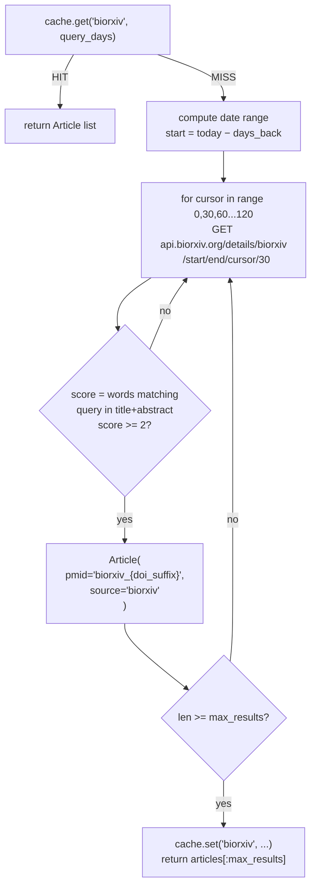

---

## Data Storage & State Management

The system has four distinct storage layers. Layers 2 and 4 are optional; the pipeline degrades gracefully if either is unavailable.

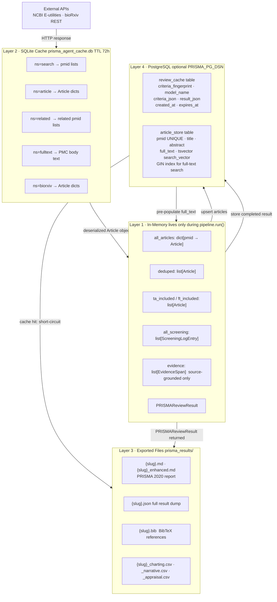

---

### Layer 1 — In-Memory Pipeline State

#### How `all_articles` dict is built

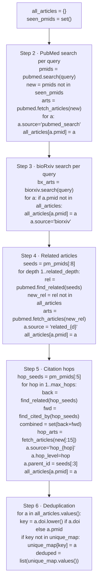

#### Article state transitions

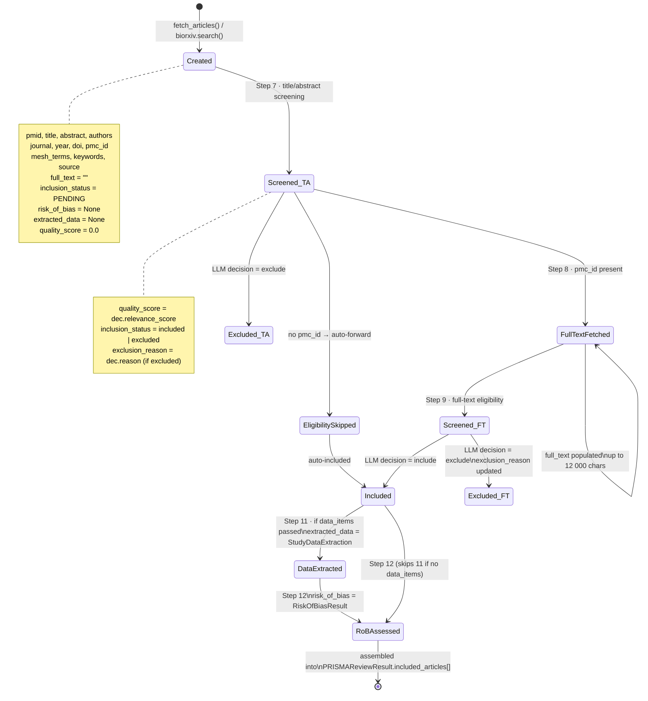

#### EvidenceSpan — extraction and deduplication

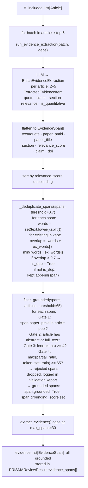

---

### Layer 2 — SQLite Cache

#### Schema

```sql
CREATE TABLE IF NOT EXISTS cache (
    key        TEXT PRIMARY KEY,   -- SHA256 hex digest of "ns:ident"
    value      TEXT,               -- JSON blob
    created_at TEXT                -- ISO 8601 datetime string
);
```

#### Key derivation

```python
key = hashlib.sha256(f"{ns}:{ident}".encode()).hexdigest()
```

#### Cache read and write paths

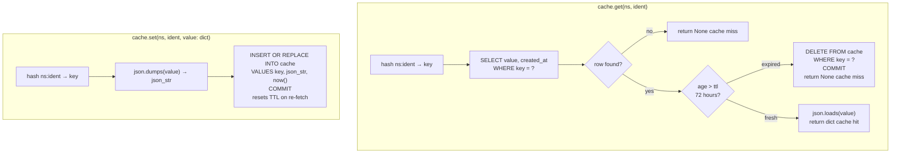

#### Namespace reference

| Namespace | Identifier | Stored value |
|---|---|---|
| `"search"` | `"{query}_{max}_{date_start}_{date_end}"` | `{"pmids": ["123", ...]}` |
| `"article"` | `"{pmid}"` | `Article.model_dump()` |
| `"related"` | `"{sorted_pmids_joined}"` | `{"pmids": [...]}` |
| `"fulltext"` | `"{pmc_id}"` e.g. `"PMC9876543"` | `{"text": "..."}` up to 12 000 chars |
| `"biorxiv"` | `"{query}_{days_back}"` | `{"articles": [Article.model_dump(), ...]}` |

#### Per-method cache flow

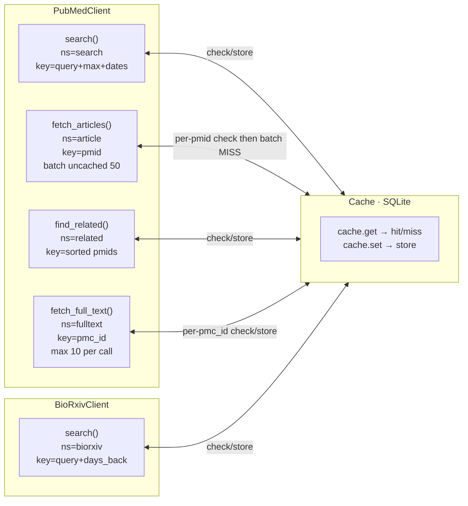

#### TTL and expiry

- Default TTL: **72 hours** (`ttl_hours` param on `Cache.__init__`)
- Expiry is **lazy** — checked only on `get()`, no background vacuum
- Expired rows are deleted when first accessed after expiry
- `cache.clear()` → `DELETE FROM cache` — wipes all namespaces immediately
- Pass `enable_cache=False` to `PRISMAReviewPipeline` to skip cache entirely (`self.cache = None`; all `if self.cache:` guards in client methods are skipped)

---

### Layer 3 — Exported Files

`pipeline.run()` returns `PRISMAReviewResult`. The pipeline never writes files — that is the caller's responsibility. `main.py` writes to `prisma_results/`.

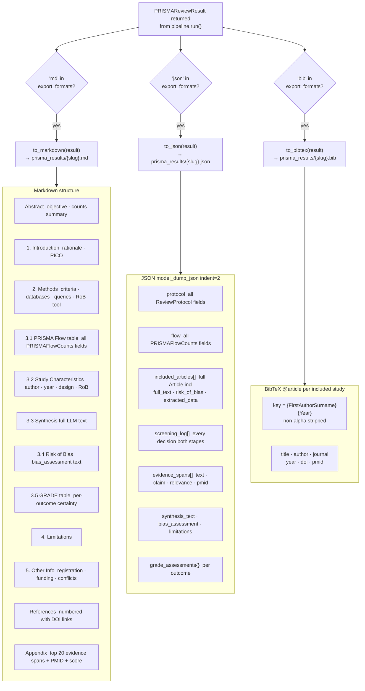

---

## PRISMA Flow Diagram — How It Works

`PRISMAFlowCounts` tracks article counts at every gate in the PRISMA 2020 flow diagram. This is how the pipeline populates each field.

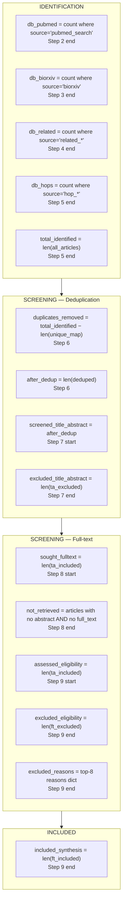

### Deduplication key priority

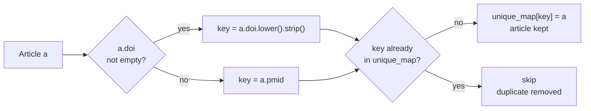

### Screening bias by stage

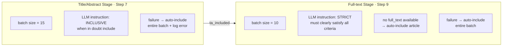

### Graceful degradation at each gate

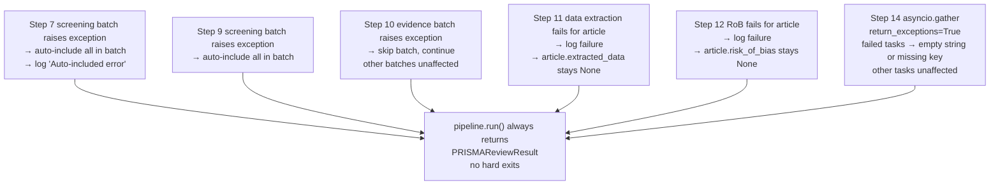

---

## Design Decisions

### 1. Agent-per-task, not a single mega-agent

Each PRISMA step that requires LLM reasoning has its own `Agent` with a dedicated system prompt, output model, and retry count. This gives independent prompt tuning, typed validated output (no string parsing), isolated retry logic, and easy replacement of any single step.

### 2. pydantic-ai for structured LLM output

All LLM outputs are Pydantic `BaseModel` subclasses. pydantic-ai handles parsing, automatic re-prompting on validation failure (`retries=2`), and typed return values with zero manual JSON handling.

### 3. `defer_model_check=True` — model injected at runtime

Agents are declared at module level without a model. The same agent instance works with any model the caller provides. Switching from Claude to GPT-4o to DeepSeek requires only the `model_name` argument.

### 4. OpenRouter as the single LLM gateway

`OpenRouterProvider` gives access to 100+ models through one API key. No vendor lock-in; cost and capability can be tuned per deployment without code changes.

### 5. Synchronous HTTP clients, async pipeline

`httpx.Client` (synchronous) is used in clients for simplicity — rate limiting via `time.sleep()` is straightforward. The pipeline is `async` to allow `asyncio.gather()` in step 14. If higher throughput is needed, replace with `httpx.AsyncClient`.

### 6. SQLite cache with 72-hour TTL

A local SQLite file caches all HTTP responses. Allows fast re-runs during development, offline re-analysis, and reduced NCBI rate-limit pressure. Cache is keyed by SHA256(namespace:identifier) — different query parameters produce different entries.

### 7. Two-stage screening with opposite biases

Title/abstract screening is inclusive (recall-optimised); full-text screening is strict (precision-optimised). This mirrors PRISMA best practice. Articles that pass title/abstract but have no retrievable full text are automatically forwarded.

### 8. Evidence deduplication by word overlap

Evidence spans are deduplicated using Jaccard-like word overlap at threshold 0.7. Removes near-identical paraphrases while keeping distinct claims. Threshold chosen empirically to catch paraphrases without removing legitimately similar but distinct evidence.

### 9. Parallel execution only where safe (step 14)

`asyncio.gather()` is used only in step 14 (bias summary, GRADE, limitations) because these tasks are fully independent of each other. All earlier steps are sequential because each depends on the previous step's output.

### 10. No hardcoded domain knowledge in prompts

System prompts contain methodological instructions but no field-specific content. All domain content (PICO, criteria, outcomes) comes from `ReviewProtocol` fields injected at call time via `@agent.system_prompt` context functions, making the pipeline domain-agnostic.

### 11. Source grounding — verify before trusting LLM quotes

The evidence extraction agent is instructed not to fabricate, but instruction alone is not enforcement. `validation.py` runs every extracted span through a four-gate check: PMID exists in article pool, article has retrievable text, span is long enough to verify (≥ 4 tokens), and `max(partial_ratio, token_set_ratio) ≥ 65`. Spans failing any gate are silently dropped and counted in a `ValidationReport`. This provides a computational backstop against hallucination in citations.

### 12. PostgreSQL cache with SHA-256 fingerprinting + weighted fuzzy similarity

Identical criteria are fingerprinted with SHA-256 (normalised, lowercase, sorted lists) and looked up in O(1) via a unique index. Near-identical criteria (≥ 95% default) are caught by a full scan with weighted `token_set_ratio` across 11 criteria fields (title 25%, inclusion/exclusion 40% combined, etc.). The weighted scan runs in Python — no PostgreSQL extension needed. Advisory locks (`pg_try_advisory_xact_lock`) prevent duplicate pipeline runs under concurrency. Cache is entirely optional: if `pg_dsn` is empty or the connection fails, the pipeline runs normally.

### 13. LinkML schema as the canonical RDF vocabulary

`prisma_review_agent/ontology/slr_ontology.yaml` is a [LinkML](https://linkml.io/) schema (v0.2.0) that defines the complete class hierarchy for systematic reviews. It generates `slr_ontology.schema.json` (JSON Schema) and `slr_ontology.owl.ttl` (OWL/Turtle) as derived artifacts via `gen-json-schema` and `gen-owl`. The Python export code (`rdf_export.py`) does not import linkml at runtime — it uses `rdflib` directly with the URI constants specified in the schema, keeping the runtime dependency minimal. Regenerate derived artifacts with `linkml-lint slr_ontology.yaml && gen-json-schema slr_ontology.yaml > slr_ontology.schema.json && gen-owl slr_ontology.yaml > slr_ontology.owl.ttl`.

### 14. Pyoxigraph store via Turtle round-trip

`rdf_store.py` populates a `pyoxigraph.Store` by serializing the rdflib graph to Turtle bytes and loading them into pyoxigraph, rather than translating the graph object directly. This is intentional: rdflib and pyoxigraph have incompatible internal representations, and Turtle is a lossless, widely-supported interchange format. The round-trip adds ~10 ms for typical reviews (< 100 sources) — negligible compared to pipeline runtime. For large reviews, call `store.save(path)` once and `store.load_from_file(path)` on subsequent sessions to avoid re-serialization.

### 16. Plan confirmation — callback-first, TTY detection, no `input()` in core pipeline

After step 1 (search strategy generation), `pipeline.run()` optionally pauses at a confirmation checkpoint (step 1a). The design keeps the pipeline free of terminal dependencies:

- `confirm_callback: Callable[[ReviewPlan], bool | str] | None` is the primary mechanism. The pipeline calls it with a `ReviewPlan` and interprets `True`/`""` as approval, `False` as rejection (raises `PlanRejectedError`), and any other string as feedback that triggers re-generation via `run_search_strategy(user_feedback=feedback)`.
- `auto_confirm=True` bypasses the checkpoint entirely, restoring pre-feature behavior. All existing callers (`pipeline.run()`, `pipeline.run(progress_callback=cb)`, `pipeline.run(data_items=[...])`) are unaffected by default.
- TTY detection: when neither `auto_confirm` nor `confirm_callback` is set and `sys.stdin.isatty()` returns `False`, the pipeline logs a warning and defaults to auto mode — matching the behavior of Unix tools like `git` and `pip` in non-interactive environments.
- `_cli_confirm()` lives in `main.py` (not `pipeline.py`) and is passed as `confirm_callback`. This is the key architectural boundary: `input()` never enters the core library.
- `MaxIterationsReachedError(iterations, max_allowed)` is raised when the for-else loop exhausts `max_plan_iterations` iterations without approval.

### 15. ArticleStore as a growing source library

Every article fetched during any review run is upserted into `article_store`. On subsequent runs, `get_by_pmids()` pre-populates `full_text` before the PubMed API is called, reducing NCBI load and latency. The `tsvector` GIN index enables fast keyword search over the accumulated article library for future source retrieval without hitting external APIs.

---

## Adding a New Agent

1. **Define the output model** in [models.py](models.py):
   ```python
   class MyOutput(BaseModel):
       result: str
       confidence: float = 0.5
   ```

2. **Declare the agent** in [agents.py](agents.py):
   ```python
   my_agent = Agent(
       output_type=MyOutput,
       deps_type=AgentDeps,
       system_prompt="You are a ...",
       retries=2,
       defer_model_check=True,
   )

   @my_agent.system_prompt
   async def _my_context(ctx: RunContext[AgentDeps]) -> str:
       return f"Research Question: {ctx.deps.protocol.question}"
   ```

3. **Write the runner**:
   ```python
   async def run_my_step(article: Article, deps: AgentDeps) -> MyOutput:
       model = build_model(deps.api_key, deps.model_name)
       result = await my_agent.run(
           f"Title: {article.title}\nAbstract: {article.abstract[:1000]}",
           deps=deps,
           model=model,
       )
       return result.output
   ```

4. **Call it in** [pipeline.py](pipeline.py) at the appropriate step; store result on the article or result object.

5. **Re-export** from `prisma_review_agent/__init__.py` if it is part of the public API.

---

## Environment & Configuration

| Variable | Required | Description |
|---|---|---|
| `OPENROUTER_API_KEY` | Yes | Passed via `--api-key` CLI arg or directly to `PRISMAReviewPipeline` |
| `NCBI_API_KEY` | No | Enables 10 req/s vs 3 req/s at NCBI |
| `PRISMA_PG_DSN` | No | PostgreSQL DSN for review result cache + article store. Overridden by `--pg-dsn`. |

### Pipeline Constructor Parameters

```python
PRISMAReviewPipeline(
    api_key: str,               # OpenRouter API key (required)
    model_name: str,            # Default: "anthropic/claude-sonnet-4"
    ncbi_api_key: str,          # Default: "" (anonymous NCBI access)
    protocol: ReviewProtocol,   # Review protocol (required for useful results)
    enable_cache: bool,         # Default: True — SQLite cache on/off
    max_per_query: int,         # Default: 20 — max results per PubMed query
    related_depth: int,         # Default: 1 — rounds of related article expansion
    biorxiv_days: int,          # Default: 180 — bioRxiv lookback window in days
)
```

### ReviewProtocol — PostgreSQL Cache Fields

```python
ReviewProtocol(
    ...
    pg_dsn: str,                # PostgreSQL DSN — activates cache when non-empty
    force_refresh: bool,        # Default: False — bypass cache, overwrite on completion
    cache_threshold: float,     # Default: 0.95 — min similarity score for a cache hit
    cache_ttl_days: int,        # Default: 30 — days until entry expires; 0 = never
)
```

### Cache CLI Flags

```
--pg-dsn DSN            PostgreSQL DSN (also reads PRISMA_PG_DSN env var)
--force-refresh         Bypass cache lookup; overwrite entry on completion
--cache-threshold FLOAT Similarity threshold 0.0–1.0 (default 0.95)
--cache-ttl-days DAYS   Cache TTL in days; 0 = never expire (default 30)
```

### Running the Migration

Before first use, run:

```bash
psql "$PRISMA_PG_DSN" -f prisma_review_agent/cache/migrations/001_initial.sql
```

This creates `review_cache` and `article_store` tables with all required indexes.

### RoB Tool Selection

Set `ReviewProtocol.rob_tool` to one of the `RoBTool` enum values. The agent's domain list is pulled from `ROB_DOMAINS` in [agents.py](agents.py):

| Tool | Study type |
|---|---|
| `RoBTool.ROB_2` | Randomised trials |
| `RoBTool.ROBINS_I` | Non-randomised interventions |
| `RoBTool.ROBINS_E` | Non-randomised exposures |
| `RoBTool.NOS` | Cohort / case-control |
| `RoBTool.QUADAS_2` | Diagnostic accuracy |
| `RoBTool.CASP` | Qualitative studies |
| `RoBTool.JBI` | Prevalence / cross-sectional |
| `RoBTool.MURAD` | Case reports / series |
| `RoBTool.SYRCLE` | Animal studies |
| `RoBTool.MINORS` | Non-randomised surgical |
| `RoBTool.ROBIS` | Systematic reviews |
| `RoBTool.JADAD` | Older RCT quality scale |
