# Developer Documentation — PRISMA Review Agent

## Table of Contents

- [Architecture Overview](#architecture-overview)
- [Repository Layout](#repository-layout)
- [Module Responsibilities](#module-responsibilities)
- [Data Models](#data-models)
  - [Core Model Relationships](#core-model-relationships)
  - [Feature 006 — Field-Level Charting & Appraisal Models](#feature-006--field-level-charting--appraisal-models)
  - [Feature 007 — Multi-Model Compare Models](#feature-007--multi-model-compare-models)
- [Pipeline Flow — Step by Step](#pipeline-flow--step-by-step)
- [Agent Architecture](#agent-architecture)
- [HTTP Clients & Caching](#http-clients--caching)
- [Data Storage & State Management](#data-storage--state-management)
- [PRISMA Flow Diagram — How It Works](#prisma-flow-diagram--how-it-works)
- [Provenance & Reconstruct](#provenance--reconstruct)
- [Design Decisions](#design-decisions)
- [Adding a New Agent](#adding-a-new-agent)
- [Environment & Configuration](#environment--configuration)

---

## Architecture Overview

The system is a **fully async Python pipeline** that automates PRISMA 2020 systematic literature reviews. It chains HTTP-based data acquisition (PubMed, bioRxiv) with LLM-powered analysis (screening, synthesis, risk of bias, etc.) using [pydantic-ai](https://docs.pydantic.dev/latest/integrations/pydantic_ai/) agents that return strongly-typed, validated outputs.

A **PostgreSQL cache layer** short-circuits the pipeline for repeated or highly-similar review requests (≥ 95% criteria similarity). A **source grounding validator** ensures every extracted evidence span is traceable back to actual article text.

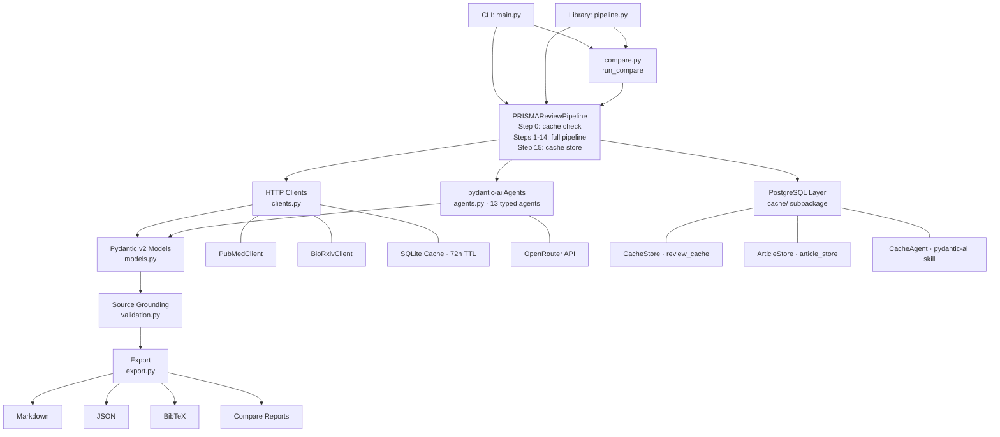

---

## Repository Layout

```
synthscholar/
├── main.py               # CLI entry point (argparse)
├── pipeline.py           # Core async orchestrator (PRISMAReviewPipeline)
├── compare.py            # Multi-model compare: run_compare(), _run_model_pipeline(), _compute_field_agreement()
├── agents.py             # 13 pydantic-ai agents + runner functions
├── models.py             # All Pydantic v2 data models
├── clients.py            # HTTP clients: PubMedClient, BioRxivClient, Cache
├── evidence.py           # Evidence extraction + source grounding validation
├── validation.py         # Source grounding validator (rapidfuzz)
├── export.py             # to_markdown(), to_json(), to_bibtex(), to_compare_markdown(), to_compare_json(), ...
├── __init__.py           # Root package (dev use)
├── synthscholar/  # Installable package
│   ├── __init__.py       # Public API re-exports
│   ├── ontology/         # SLR Ontology integration — LinkML schema + RDF export
│   │   ├── __init__.py       # Re-exports to_turtle, to_jsonld
│   │   ├── slr_ontology.yaml # LinkML schema (v0.2.0, 1844 lines)
│   │   ├── slr_ontology.schema.json  # Generated JSON Schema
│   │   ├── slr_ontology.owl.ttl      # Generated OWL/Turtle
│   │   ├── namespaces.py     # rdflib.Namespace constants + URI-minting helpers
│   │   ├── rdf_export.py     # _build_graph(), to_turtle(), to_jsonld()
│   │   └── rdf_store.py      # SLRStore — pyoxigraph-backed SPARQL store
│   ├── cache/            # PostgreSQL cache sub-package
│   │   ├── __init__.py   # Package exports
│   │   ├── models.py     # CacheEntry, CacheLookupResult, SimilarityConfig, StoredArticle
│   │   ├── similarity.py # compute_fingerprint(), compute_similarity()
│   │   ├── store.py      # CacheStore — async PostgreSQL CRUD
│   │   ├── article_store.py  # ArticleStore — article persistence + full-text search
│   │   ├── skill.py      # pydantic-ai CacheAgent with @agent.tool tools
│   │   ├── admin.py      # list_entries(), inspect_entry(), clear_all()
│   │   └── migrations/
│   │       └── 001_initial.sql  # review_cache + article_store DDL
│   └── *.py              # (same modules as root)
├── pyproject.toml        # Build config, deps, entry point
└── developer.md          # This file
```

The `synthscholar/` package is the installable form; root-level `.py` files are for direct development. Both contain the same code.

---

## Module Responsibilities

| Module | Responsibility | Key Types |
|---|---|---|
| `models.py` | All Pydantic v2 data models — no logic | `Article`, `ReviewProtocol`, `PRISMAFlowCounts`, `PRISMAReviewResult`, `EvidenceSpan`, `PrismaReview`, `ThematicSynthesisResult` (22 rich synthesis models). Per-rubric format control (005-US5): `SECTION_FORMAT`, `RubricSectionOutput`, `RubricSectionConfig`, `StudyDataExtractionReport`. **Feature 006 — field-level charting & appraisal schema**: `ANSWER_TYPE`, `FieldDefinition`, `ChartingSection`, `ChartingTemplate`, `FieldAnswer`, `SectionExtractionResult`, `CONCERN_AGGREGATION_RULE`, `AppraisalItemSpec`, `AppraisalDomainSpec`, `CriticalAppraisalConfig`, `ItemRating`, `DomainAppraisal`, `CriticalAppraisalResult`. **Feature 007 — multi-model compare**: `FieldAgreement(field_name, agreed, values: dict[str,str])`, `SynthesisDivergence(topic, positions: dict[str,str])` (validator: ≥2 positions required), `ModelReviewRun(model_name, result?, error?)` (exactly-one-of validator; `.succeeded` property), `MergedReviewResult(consensus_synthesis, field_agreement, synthesis_divergences)`, `CompareReviewResult(protocol, compare_models, model_results, merged)` (validator: ≥2 unique models). |
| `clients.py` | HTTP data acquisition + SQLite cache | `PubMedClient`, `BioRxivClient`, `Cache` |
| `agents.py` | LLM agent definitions + async runners | `AgentDeps`, 18 `Agent` instances, `run_*` functions. Rich synthesis agents: `abstract_section_agent`, `introduction_section_agent`, `thematic_synthesis_agent`, `quantitative_analysis_agent`, `discussion_section_agent`, `conclusion_section_agent`. **Feature 006**: `_apply_concern_rule(ratings, rule) -> str`; `default_charting_template() -> ChartingTemplate`; `default_appraisal_config() -> CriticalAppraisalConfig`; `run_data_charting()` and `run_critical_appraisal()` extended. **Feature 007**: `ConsensusSynthesisOutput(consensus_text, divergences: list[SynthesisDivergence])`; `consensus_synthesis_agent` (output_type=`ConsensusSynthesisOutput`, system prompt instructs cross-model synthesis); `run_consensus_synthesis(syntheses: dict[str,str], deps) -> ConsensusSynthesisOutput` (builds per-model synthesis prompt, runs agent, returns divergences alongside consensus text). |
| `pipeline.py` | Async orchestrator — calls clients, agents, cache; hosts plan confirmation checkpoint (step 1a), `_build_review_plan()` helper, and rich synthesis assembly. `assemble_prisma_review()` wraps two-wave `asyncio.gather` in `asyncio.wait_for(timeout=assemble_timeout)`. **Feature 006**: pipeline loop resolves `charting_template` / `appraisal_config`, unpacks `run_critical_appraisal()` tuple, assembles `field_answers`, stores `structured_appraisal_results`. **Feature 007**: `AcquisitionResult` dataclass `(deduped, all_search_queries, flow)` — shared output of article acquisition; `_fetch_articles() -> AcquisitionResult` (Steps 1–6: search, dedup); `_run_from_deduped(acq, **kwargs) -> PRISMAReviewResult` (Steps 7–15: LLM-dependent steps on pre-fetched articles); `run_compare(models, *, consensus_model, assemble_timeout, ...) -> CompareReviewResult` (thin wrapper delegating to `compare.run_compare()`). `run()` gains `assemble_timeout: float = 3600.0` forwarded to `assemble_prisma_review()`. | `PRISMAReviewPipeline.run(...)`, `PRISMAReviewPipeline.run_compare(models, ...)` |
| `evidence.py` | Evidence extraction + source grounding gate | `extract_evidence()` |
| `validation.py` | Source grounding validator — rapidfuzz matching | `filter_grounded()`, `validate_grounding()`, `ValidationReport` |
| `export.py` | Output formatters with cache provenance | `to_markdown()`, `to_json()`, `to_bibtex()`, `to_turtle()`, `to_jsonld()`, `to_oxigraph_store()`, `to_rubric_markdown()`, `to_rubric_json()`. **Feature 006**: `to_charting_markdown()`, `to_charting_json()`, `to_appraisal_markdown()`, `to_appraisal_json()`. **Feature 007**: `to_compare_markdown(result) -> str` (run-summary table, per-model synthesis, consensus section, divergences table), `to_compare_json(result) -> str` (`CompareReviewResult.model_dump_json(indent=2)`), `to_compare_charting_markdown(result) -> str` (per-study field comparison table with agree/differ indicators), `to_compare_charting_json(result) -> str` (`{compare_models, studies: [{source_id, fields: [{field_name, agreed, values}]}]}`). |
| `compare.py` | Multi-model parallel execution + consensus synthesis | `run_compare(pipeline, models, **kwargs) -> CompareReviewResult` (validates 2–5 unique models; calls `_fetch_articles()` once; `asyncio.gather(..., return_exceptions=True)` per model; wraps partial failures in `ModelReviewRun(error=...)`; calls `run_consensus_synthesis()`); `_run_model_pipeline(pipeline, acq, model_name, **kwargs) -> PRISMAReviewResult` (creates sub-pipeline with `enable_cache=False` and target model; calls `_run_from_deduped()` on deep-copied articles); `_compute_field_agreement(model_results) -> dict[str, FieldAgreement]` (key format `"{source_id}::{section_key}::{field_name}"`; exact + rapidfuzz fuzzy match ≥80); `_FALLBACK_CONSENSUS` constant. |
| `main.py` | CLI argument parsing + `ReviewProtocol` construction; `_cli_confirm()` callback for interactive plan confirmation; `--auto` / `--max-plan-iterations` flags; **Feature 007**: `--compare-models` flag triggers `pipeline.run_compare()` branch; writes `{slug}_compare.md`, `{slug}_compare.json`, and per-model `{slug}_{model_short}.md` | `main()`, `run_review()`, `_cli_confirm()` |
| `ontology/namespaces.py` | RDF namespace constants + URI-minting helpers | `SLR`, `PROV`, `DCTERMS`, `FABIO`, `BIBO`, `OA`; `article_uri()`, `review_uri()`, `bind_namespaces()` |
| `ontology/rdf_export.py` | rdflib graph construction + Turtle / JSON-LD serialization | `_build_graph()`, `to_turtle()`, `to_jsonld()`, `_add_charting()`, `_add_rob()`, `_add_evidence_spans()` |
| `ontology/rdf_store.py` | pyoxigraph-backed SPARQL store | `SLRStore.load()`, `.query()`, `.save()`, `.load_from_file()` |
| `cache/models.py` | Cache-specific Pydantic models + exceptions | `CacheEntry`, `CacheLookupResult`, `SimilarityConfig`, `StoredArticle` |
| `cache/similarity.py` | SHA-256 fingerprinting + weighted fuzzy scoring | `compute_fingerprint()`, `compute_similarity()` |
| `cache/store.py` | PostgreSQL async CRUD for review results | `CacheStore` |
| `cache/article_store.py` | PostgreSQL article persistence + tsvector search | `ArticleStore` |
| `cache/skill.py` | pydantic-ai CacheAgent with typed tool decorators | `cache_agent`, `cache_lookup()`, `cache_store()` |
| `cache/admin.py` | Developer utilities — inspect/list/clear cache | `list_entries()`, `inspect_entry()`, `clear_all()` |

---

## Data Models

### Core Model Relationships

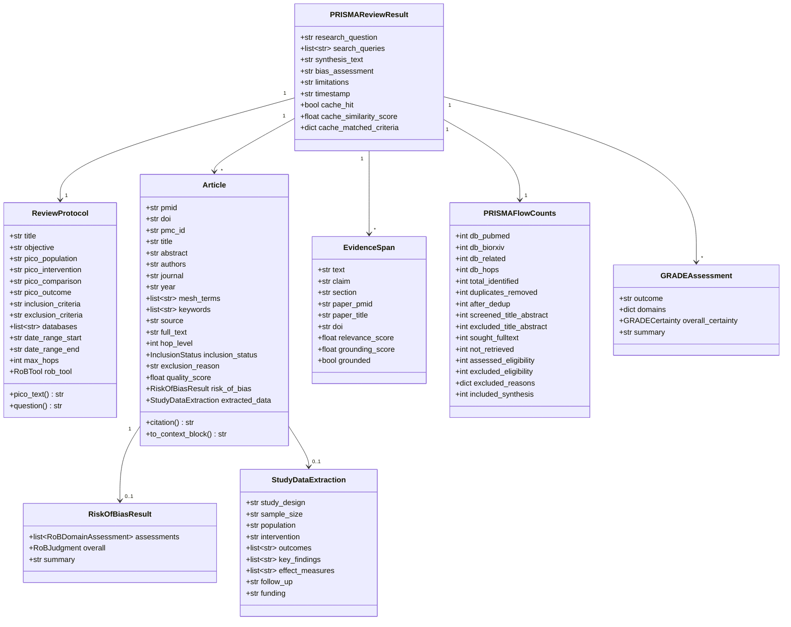

### Feature 006 — Field-Level Charting & Appraisal Models

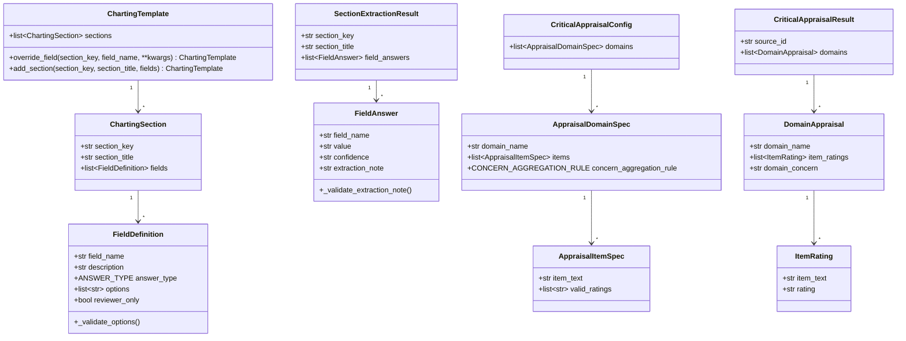

**Key invariants:**

- `FieldDefinition.answer_type in ("enumerated", "yes_no_extended")` → `options` must be non-empty.
- `yes_no_extended` options must be exactly `["Yes","No","Not Reported"]` or `["Yes","No","N/A"]`.
- `FieldAnswer.confidence == "low"` → `extraction_note` is required.
- `reviewer_only=True` fields: excluded from LLM prompt entirely; rendered as `_[Human reviewer]_` in Markdown, `{"value": null, "reviewer_only": true}` in JSON.
- `domain_concern` is computed deterministically by `_apply_concern_rule()` in Python — never delegated to the LLM.
- `ReviewProtocol` accepts both fields as `Optional`; the pipeline falls back to `default_charting_template()` / `default_appraisal_config()` when they are `None`.

### Feature 007 — Multi-Model Compare Models

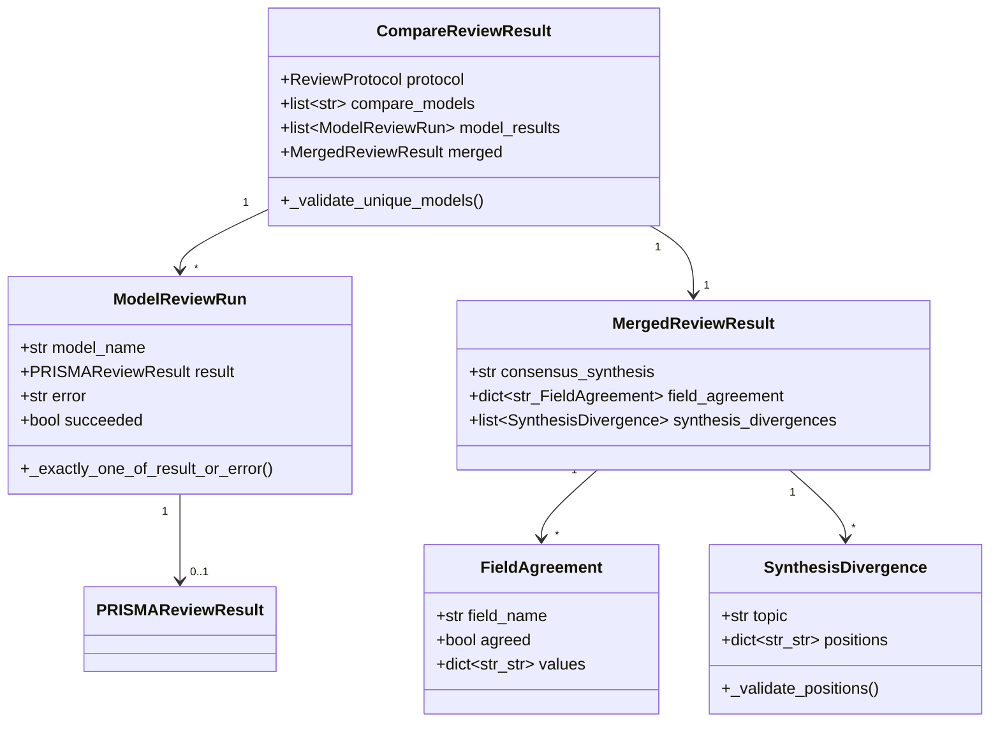

**Key invariants:**

- `CompareReviewResult.compare_models` must contain ≥ 2 unique entries (validator deduplicates and raises if fewer than 2 unique).
- `ModelReviewRun`: exactly one of `result` or `error` must be set; both `None` or both set raises `ValueError`. `.succeeded` is `result is not None`.
- `SynthesisDivergence.positions` must contain ≥ 2 entries (captures at least two models' positions on a topic).
- `MergedReviewResult.field_agreement` keys follow `"{source_id}::{section_key}::{field_name}"` format (matching `DataChartingRubric.field_answers` layout).

### LLM Output Models (agent → Pydantic)

| Agent | Output Model | Key Fields |
|---|---|---|
| `search_strategy_agent` | `SearchStrategy` | `pubmed_queries[]`, `biorxiv_queries[]`, `mesh_terms[]`, `rationale` |
| `screening_agent` | `ScreeningBatchResult` | `decisions[ScreeningDecision]` → `index, decision, reason, relevance_score` |
| `rob_agent` | `RiskOfBiasResult` | `assessments[RoBDomainAssessment]`, `overall: RoBJudgment`, `summary` |
| `data_extraction_agent` | `StudyDataExtraction` | `study_design`, `sample_size`, `outcomes[]`, `key_findings[]`, `effect_measures[]` |
| `synthesis_agent` | `str` | Full narrative synthesis in Markdown |
| `grade_agent` | `GRADEAssessment` | `domains{}, overall_certainty: GRADECertainty`, `summary` |
| `bias_summary_agent` | `str` | Overall bias narrative |
| `limitations_agent` | `str` | Limitations section (2–3 paragraphs) |
| `evidence_extraction_agent` | `BatchEvidenceExtraction` | `articles[ArticleEvidenceExtraction]` → `evidence[ExtractedEvidenceItem]` |

---

## Pipeline Flow — Step by Step

`PRISMAReviewPipeline.run()` in [pipeline.py](pipeline.py) executes up to 16 steps. Step 0 is the PostgreSQL cache gate (short-circuits the pipeline on a hit). Steps 1–13 are sequential; step 14 runs three tasks in parallel via `asyncio.gather()`; step 15 persists the result to cache.

```mermaid
flowchart TD
    INPUT([ReviewProtocol\nPICO · criteria · databases · max_hops\npg_dsn · force_refresh · cache_threshold])

    S0["Step 0 — PostgreSQL Cache Check\nif pg_dsn set and not force_refresh:\n  fingerprint = SHA-256(canonical criteria)\n  exact lookup → CacheEntry?\n  fuzzy scan → similarity >= threshold?\n  → CACHE HIT: return cached PRISMAReviewResult\n  → CACHE MISS: continue to Step 1"]

    S1["Step 1 — Search Strategy · LLM\nrun_search_strategy(deps)\n→ SearchStrategy\npubmed_queries[] · biorxiv_queries[]"]

    S2["Step 2 — PubMed Search\nesearch + efetch\nper query → Article[]"]
    S3["Step 3 — bioRxiv Search\nREST API · keyword match ≥2 words\n→ Article[]"]
    S4["Step 4 — Related Articles\nelink neighbor_score\nseeds = pm_pmids[:8]"]
    S5["Step 5 — Citation Hops\nfind_related() + find_cited_by()\nup to max_hops iterations\na.hop_level · a.parent_id set"]

    S6["Step 6 — Deduplication\nkey = doi.lower() if doi else pmid\nflow.duplicates_removed updated"]

    S7["Step 7 — Title/Abstract Screening · LLM\nrun_screening(batch, deps, 'title_abstract')\nbatch size = 15 · INCLUSIVE bias\nfailure → auto-include batch\n→ ScreeningBatchResult"]

    S8["Step 8 — Full-text Retrieval\n8a: pre-populate full_text from ArticleStore (avoids API calls)\nfetch_full_text(pmc_ids) for remaining\narticle.full_text populated up to 12 000 chars\n8b: upsert all ta_included articles to ArticleStore"]

    S9["Step 9 — Full-text Eligibility · LLM\nrun_screening(batch, deps, 'full_text')\nbatch size = 10 · STRICT\nno full_text → auto-include\nexcluded_reasons tallied"]

    S10["Step 10 — Evidence Extraction + Source Grounding\nextract_evidence(ft_included, deps)\n  LLM → raw spans (batch 5)\n  filter_grounded(spans, articles, threshold=65)\n  → only grounded spans kept\n  span.grounding_score + span.grounded stamped\nmax 30 verified spans"]

    S11["Step 11 — Data Extraction · LLM  optional\nrun_data_extraction(article, data_items, deps)\narticle.extracted_data = StudyDataExtraction\nonly runs if data_items passed to run()"]

    S12["Step 12 — Risk of Bias · LLM\nrun_risk_of_bias(article, deps) per article\narticle.risk_of_bias = RiskOfBiasResult\ndomains from ROB_DOMAINS dict"]

    S13["Step 13 — Narrative Synthesis · LLM\nrun_synthesis(ft_included, evidence, flow_text, deps)\n→ str Markdown with PMID citations\nmax 25 articles + top 20 evidence spans"]

    PAR["Step 14 — asyncio.gather PARALLEL"]
    S14A["run_bias_summary()\n→ str"]
    S14B["run_limitations()\n→ str"]
    S14C["run_grade(outcome) × 3\n→ GRADEAssessment each"]

    S15["Step 15 — Assemble PRISMAReviewResult\nprotocol · flow · included_articles\nscreening_log · evidence_spans\nsynthesis · bias · limitations · grade"]

    S16["Step 16 — PostgreSQL Cache Store\nif pg_dsn set:\n  cache_store(criteria, model, result)\n  → upsert review_cache with TTL\n  → close CacheStore + ArticleStore"]

    EXPORT["Export caller-side\nto_markdown() · to_json() · to_bibtex()\ncache_hit banner shown if result.cache_hit"]

    INPUT --> S0
    S0 -->|CACHE HIT| EXPORT
    S0 -->|CACHE MISS| S1
    S1 --> S2
    S1 --> S3
    S1 --> S4
    S2 --> S5
    S3 --> S5
    S4 --> S5
    S5 --> S6
    S6 --> S7
    S7 -->|ta_included| S8
    S8 --> S9
    S9 -->|ft_included| S10
    S10 --> S11
    S11 --> S12
    S12 --> S13
    S13 --> PAR
    PAR --> S14A
    PAR --> S14B
    PAR --> S14C
    S14A --> S15
    S14B --> S15
    S14C --> S15
    S15 --> S16
    S16 --> EXPORT
```

### Batch Sizes

| Step | Batch Size | Reason |
|---|---|---|
| Title/Abstract screening | 15 articles | Balance token cost vs. context length |
| Full-text screening | 10 articles | Larger input per article (up to 12k chars) |
| Evidence extraction | 5 articles | Highest per-article token cost; accuracy matters |
| PubMed efetch | 50 PMIDs | NCBI recommended limit |
| Full-text PMC fetch | 10 articles | Rate limit + response size |

---

## Agent Architecture

All agents follow the same pattern: declared once as a module-level constant, model injected at call time via `build_model()`.

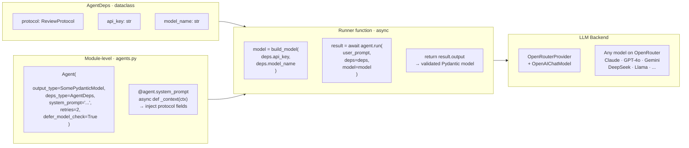

### Agent Map

| # | Agent | Runner | Output |
|---|---|---|---|
| 1 | `search_strategy_agent` | `run_search_strategy(deps)` | `SearchStrategy` |
| 2 | `screening_agent` | `run_screening(articles, deps, stage)` | `ScreeningBatchResult` |
| 3 | `rob_agent` | `run_risk_of_bias(article, deps)` | `RiskOfBiasResult` |
| 4 | `data_extraction_agent` | `run_data_extraction(article, items, deps)` | `StudyDataExtraction` |
| 5 | `data_charting_agent` | `run_data_charting(article, deps, *, charting_template=None)` | `DataChartingRubric` |
| 6 | `critical_appraisal_agent` | `run_critical_appraisal(article, rubric, deps, appraisal_domains, *, appraisal_config=None)` | `tuple[CriticalAppraisalRubric, CriticalAppraisalResult]` |
| 7 | `narrative_row_agent` | `run_narrative_row(rubric, appraisal, deps)` | `PRISMANarrativeRow` |
| 8 | `synthesis_agent` | `run_synthesis(articles, evidence, flow, deps)` | `str` |
| 9 | `grade_agent` | `run_grade(outcome, articles, deps)` | `GRADEAssessment` |
| 10 | `bias_summary_agent` | `run_bias_summary(articles, deps)` | `str` |
| 11 | `limitations_agent` | `run_limitations(flow, articles, deps)` | `str` |
| 12 | `evidence_extraction_agent` | `run_evidence_extraction(articles, deps)` | `BatchEvidenceExtraction` |
| 13 | `consensus_synthesis_agent` | `run_consensus_synthesis(syntheses, deps)` | `ConsensusSynthesisOutput` (**Feature 007** — compare mode only; receives per-model synthesis texts, returns unified `consensus_text` + `divergences[]`) |

---

## HTTP Clients & Caching

### PubMedClient — NCBI E-utilities call chain

```mermaid
flowchart TD
    subgraph search["search(query, max, date_start, date_end)"]
        S1["cache.get('search', key)"] -->|HIT| SR[return pmids]
        S1 -->|MISS| S2["GET esearch.fcgi\n?db=pubmed&term=...&retmax=..."]
        S2 --> S3["cache.set('search', key, pmids)\nreturn pmids"]
    end

    subgraph fetch["fetch_articles(pmids)"]
        F1["for each pmid:\ncache.get('article', pmid)"] -->|HIT| FA[Article from cache]
        F1 -->|MISS| FB[add to uncached list]
        FB --> F2["GET efetch.fcgi\n?db=pubmed&id=batch50&rettype=xml"]
        F2 --> F3["_parse_xml(xml) → Article[]\nregex: pmid, title, abstract,\nauthors, journal, year,\ndoi, pmc_id, mesh_terms, keywords"]
        F3 --> F4["cache.set('article', pmid, Article.model_dump())"]
    end

    subgraph related["find_related(pmids)"]
        R1["cache.get('related', sorted_pmids)"] -->|HIT| RR[return pmids]
        R1 -->|MISS| R2["GET elink.fcgi\n?cmd=neighbor_score\n&linkname=pubmed_pubmed"]
        R2 --> R3["cache.set('related', ...)\nreturn related pmids"]
    end

    subgraph citedin["find_cited_by(pmids)"]
        C1["GET elink.fcgi\n?linkname=pubmed_pubmed_citedin"]
        C1 -->|exception| CE[return empty list]
        C1 --> C2[return cited pmids]
    end

    subgraph fulltext["fetch_full_text(pmc_ids · max 10)"]
        FT1["cache.get('fulltext', pmc_id)"] -->|HIT| FTR[results dict]
        FT1 -->|MISS| FT2["GET efetch.fcgi\n?db=pmc&id=PMCxxxxxx"]
        FT2 --> FT3["extract body XML\nstrip tags · truncate 12 000 chars"]
        FT3 --> FT4["cache.set('fulltext', pmc_id, text)"]
    end
```

Rate limit: `time.sleep(0.35)` before every NCBI request. Providing `NCBI_API_KEY` enables 10 req/s.

### BioRxivClient

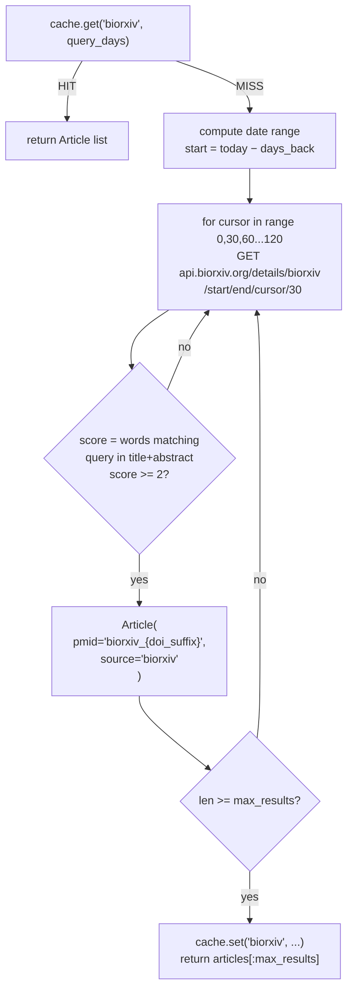

---

## Data Storage & State Management

The system has four distinct storage layers. Layers 2 and 4 are optional; the pipeline degrades gracefully if either is unavailable.

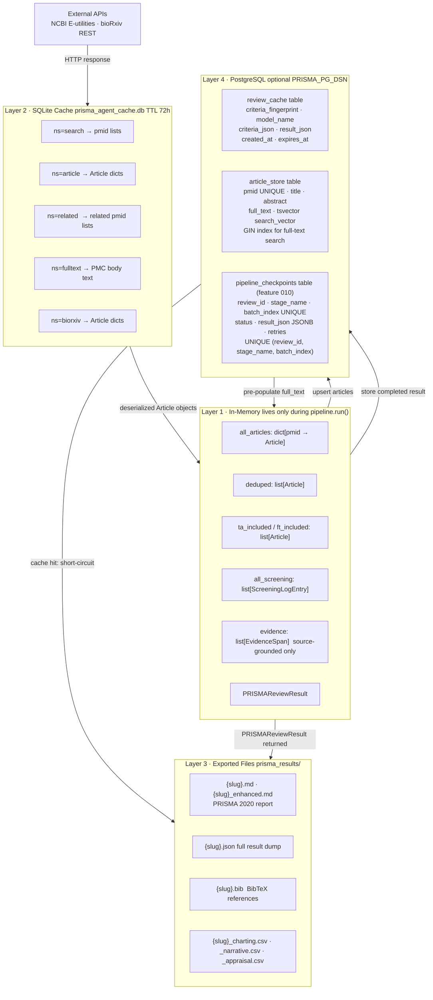

---

### Layer 1 — In-Memory Pipeline State

#### How `all_articles` dict is built

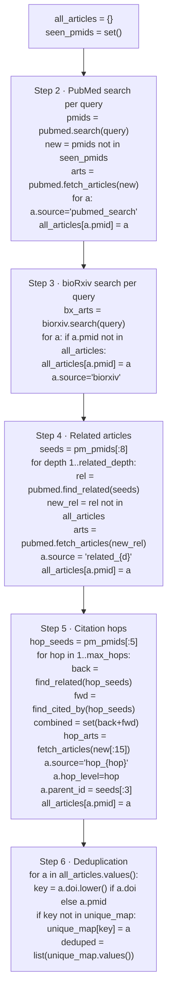

#### Article state transitions

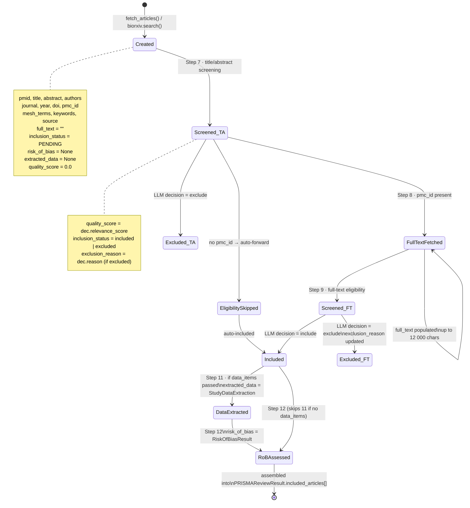

#### EvidenceSpan — extraction and deduplication

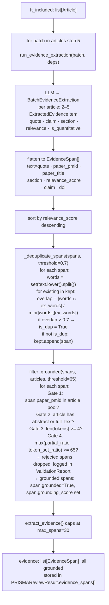

---

### Layer 2 — SQLite Cache

#### Schema

```sql
CREATE TABLE IF NOT EXISTS cache (
    key        TEXT PRIMARY KEY,   -- SHA256 hex digest of "ns:ident"
    value      TEXT,               -- JSON blob
    created_at TEXT                -- ISO 8601 datetime string
);
```

#### Key derivation

```python
key = hashlib.sha256(f"{ns}:{ident}".encode()).hexdigest()
```

#### Cache read and write paths

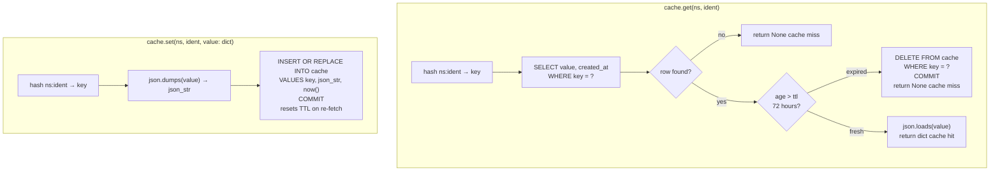

#### Namespace reference

| Namespace | Identifier | Stored value |
|---|---|---|
| `"search"` | `"{query}_{max}_{date_start}_{date_end}"` | `{"pmids": ["123", ...]}` |
| `"article"` | `"{pmid}"` | `Article.model_dump()` |
| `"related"` | `"{sorted_pmids_joined}"` | `{"pmids": [...]}` |
| `"fulltext"` | `"{pmc_id}"` e.g. `"PMC9876543"` | `{"text": "..."}` up to 12 000 chars |
| `"biorxiv"` | `"{query}_{days_back}"` | `{"articles": [Article.model_dump(), ...]}` |

#### Per-method cache flow

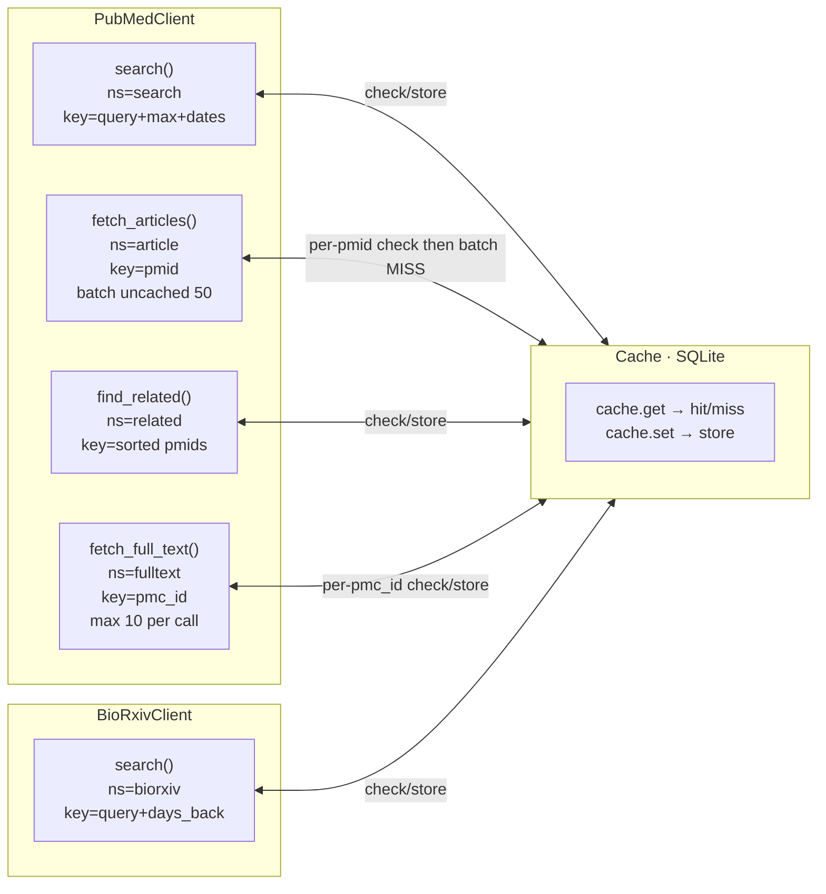

#### TTL and expiry

- Default TTL: **72 hours** (`ttl_hours` param on `Cache.__init__`)
- Expiry is **lazy** — checked only on `get()`, no background vacuum
- Expired rows are deleted when first accessed after expiry
- `cache.clear()` → `DELETE FROM cache` — wipes all namespaces immediately
- Pass `enable_cache=False` to `PRISMAReviewPipeline` to skip cache entirely (`self.cache = None`; all `if self.cache:` guards in client methods are skipped)

---

### Layer 3 — Exported Files

`pipeline.run()` returns `PRISMAReviewResult`. The pipeline never writes files — that is the caller's responsibility. `main.py` writes to `prisma_results/`.

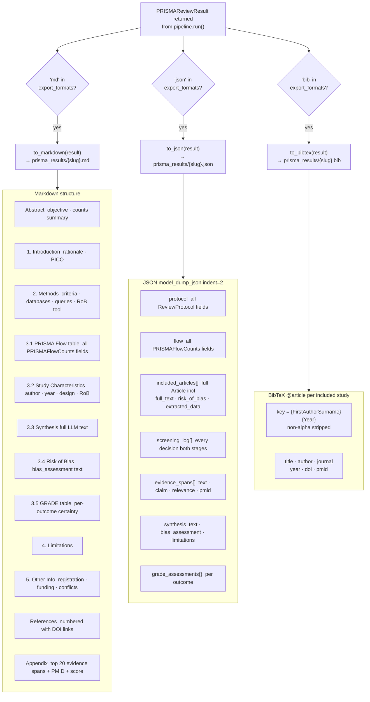

---

## PRISMA Flow Diagram — How It Works

`PRISMAFlowCounts` tracks article counts at every gate in the PRISMA 2020 flow diagram. This is how the pipeline populates each field.

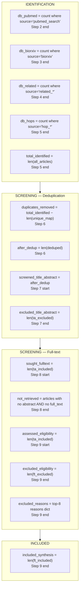

### Deduplication key priority

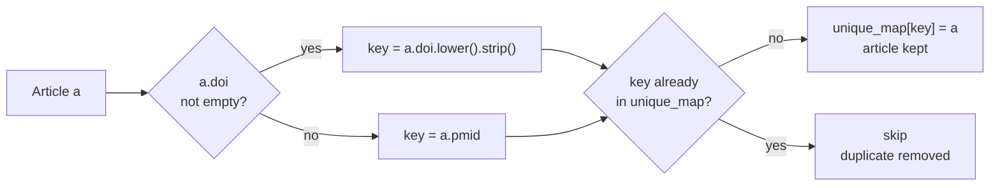

### Screening bias by stage

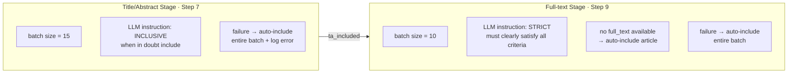

### Graceful degradation at each gate

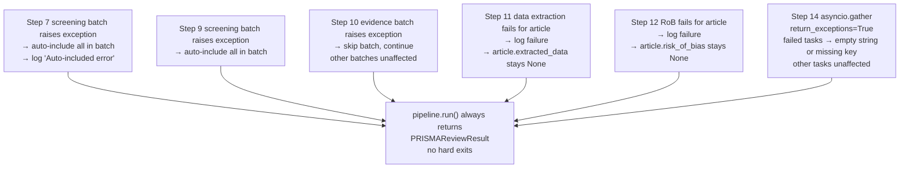

---

## Provenance & Reconstruct

The system captures full provenance for every review at two levels: a **semantic RDF graph** (who reviewed what, when, using which model and criteria) and a **relational snapshot** (the full result JSON + every article that was considered). Together they let you reconstruct any prior review from scratch or replay it in a UI.

### How provenance is captured

#### RDF layer (`ontology/rdf_export.py` + `ontology/rdf_store.py`)

Every call to `to_turtle()` / `to_jsonld()` builds an rdflib graph that includes a `prov:` provenance subgraph alongside the review content:

```turtle
@prefix prov: <http://www.w3.org/ns/prov#> .
@prefix slr:  <https://w3id.org/slr/ontology#> .
@prefix dcterms: <http://purl.org/dc/terms/> .

<urn:slr:review:{criteria_fingerprint}>
    a slr:SystematicReview ;
    dcterms:created "{timestamp}"^^xsd:dateTime ;
    prov:wasGeneratedBy <urn:slr:activity:{criteria_fingerprint}> ;
    prov:used <urn:slr:protocol:{criteria_fingerprint}> .

<urn:slr:activity:{criteria_fingerprint}>
    a prov:Activity ;
    prov:startedAtTime  "{timestamp}"^^xsd:dateTime ;
    prov:endedAtTime    "{timestamp}"^^xsd:dateTime ;
    prov:wasAssociatedWith <urn:slr:agent:llm:{model_name}> .

<urn:slr:agent:llm:{model_name}>
    a prov:SoftwareAgent ;
    rdfs:label "{model_name}" .
```

Each included article gets a `prov:wasDerivedFrom` triple linking it to the review activity. Evidence spans get `prov:wasQuotedFrom` triples back to their source article URI.

#### PostgreSQL layer (`cache/store.py` + `cache/article_store.py`)

| Table | What is stored | Key provenance fields |
|---|---|---|
| `review_cache` | Full `PRISMAReviewResult` as JSON | `criteria_fingerprint` (SHA-256), `model_name`, `created_at`, `expires_at`, `criteria_json` |
| `article_store` | Every article ever fetched | `pmid`, `title`, `abstract`, `full_text`, `tsvector` search index |

The `criteria_fingerprint` is the bridge: the RDF graph URI `urn:slr:review:{fingerprint}` matches the `criteria_fingerprint` in `review_cache`, so you can round-trip between the RDF provenance and the full result payload.

### How to reconstruct a prior review

**Step 1 — look up by fingerprint (exact match)**

```python
from synthscholar.cache.store import CacheStore
from synthscholar.cache.similarity import compute_fingerprint

async with CacheStore(pg_dsn) as store:
    fingerprint = compute_fingerprint(protocol)
    entry = await store.lookup_exact(fingerprint)
    if entry:
        result = PRISMAReviewResult.model_validate_json(entry.result_json)
```

**Step 2 — look up by similarity (fuzzy match)**

```python
    hit = await store.lookup_similar(protocol, threshold=0.90)
    # hit.similarity_score tells you how close the criteria were
    result = PRISMAReviewResult.model_validate_json(hit.entry.result_json)
```

**Step 3 — re-hydrate articles from ArticleStore**

The `result_json` snapshot includes article metadata but may not include `full_text` (large blobs are trimmed in some export paths). Re-attach full text from the article library:

```python
from synthscholar.cache.article_store import ArticleStore

async with ArticleStore(pg_dsn) as astore:
    pmids = [a.pmid for a in result.included_articles]
    stored = await astore.get_by_pmids(pmids)
    by_pmid = {a.pmid: a for a in stored}
    for article in result.included_articles:
        if article.pmid in by_pmid:
            article.full_text = by_pmid[article.pmid].full_text
```

**Step 4 — re-attach RDF provenance**

```python
from synthscholar.ontology.rdf_store import SLRStore

store = SLRStore(path="review_store.oxigraph")
store.load_from_file("prior_review.ttl")

# Query who generated the review
sparql = """
PREFIX prov: <http://www.w3.org/ns/prov#>
PREFIX slr:  <https://w3id.org/slr/ontology#>
SELECT ?agent ?started WHERE {
    ?activity a prov:Activity ;
              prov:wasAssociatedWith ?agent ;
              prov:startedAtTime ?started .
}
"""
rows = store.query(sparql)
```

**Useful SPARQL queries**

```sparql
# All reviews in the store with their timestamps
SELECT ?review ?created WHERE {
    ?review a slr:SystematicReview ;
            dcterms:created ?created .
} ORDER BY DESC(?created)

# Which model was used for a specific fingerprint
SELECT ?model WHERE {
    <urn:slr:review:{fingerprint}> prov:wasGeneratedBy ?activity .
    ?activity prov:wasAssociatedWith ?model .
}

# All articles used as evidence in a review
SELECT ?article ?title WHERE {
    <urn:slr:review:{fingerprint}> prov:used ?article .
    ?article dcterms:title ?title .
}

# Evidence spans with their source articles
SELECT ?span ?claim ?source WHERE {
    ?span a slr:EvidenceSpan ;
          slr:claim ?claim ;
          prov:wasQuotedFrom ?source .
}
```

### UI perspective — provenance view and reconstruct

A front-end can surface provenance and offer reconstruct/replay by consuming the two storage layers:

#### Provenance view (read-only display)

| UI element | Data source | Field |
|---|---|---|
| Review timestamp | `review_cache.created_at` | ISO 8601 |
| Model used | `review_cache.model_name` or RDF `prov:wasAssociatedWith` | string |
| Criteria fingerprint | `review_cache.criteria_fingerprint` | SHA-256 hex (first 12 chars as display ID) |
| Similarity score (if fuzzy hit) | `CacheLookupResult.similarity_score` | 0.0–1.0, render as % |
| Article count | `len(result.included_articles)` | integer |
| Evidence spans | `result.evidence_spans` | list; show grounding_score per span |
| Charting results | `result.structured_appraisal_results` | per-domain concern; heat-map by concern level |
| RDF graph download | `to_turtle(result)` | offer as `.ttl` export button |

**Recommended provenance panel layout:**

```
┌─ Review provenance ─────────────────────────────────────────────────────┐
│  ID        3f9a2c1d                   (first 12 chars of fingerprint)   │
│  Created   2026-04-17 14:32 UTC                                         │
│  Model     anthropic/claude-sonnet-4                                    │
│  Articles  47 included  (312 screened)                                  │
│  Cache     HIT  similarity 97.3%  [view matched criteria]               │
│  [Download Turtle]  [Download JSON]  [Reconstruct]                      │
└─────────────────────────────────────────────────────────────────────────┘
```

#### Reconstruct / replay from UI

The "Reconstruct" action re-runs the pipeline using the stored `criteria_json` as input, optionally with `force_refresh=True` to bypass the cache. The UI flow:

1. User clicks **Reconstruct** on a prior review entry.
2. Front-end loads `review_cache.criteria_json` → deserializes into `ReviewProtocol`.
3. Front-end optionally lets the user override `model_name` or `force_refresh`.
4. Calls `PRISMAReviewPipeline(protocol=reconstructed_protocol, ...).run()`.
5. Streams `progress_callback` events to update a live progress bar.
6. On completion, renders the new result side-by-side with the original for diff comparison.

```python
# Minimal reconstruct from a stored criteria_json
import json
from synthscholar import PRISMAReviewPipeline, ReviewProtocol

raw = json.loads(cache_entry.criteria_json)
protocol = ReviewProtocol.model_validate(raw)
protocol.force_refresh = True   # bypass cache to get a fresh run

pipeline = PRISMAReviewPipeline(
    api_key=api_key,
    model_name=override_model or cache_entry.model_name,
    protocol=protocol,
)
result = await pipeline.run(progress_callback=emit_to_websocket)
```

The `charting_template` and `critical_appraisal_config` stored in the original `ReviewProtocol` are automatically carried forward during reconstruct, ensuring the same field schema is applied to the new run.

---

## Feature 010 — Iterative Large-Review Processing

### New `pipeline_checkpoints` Table

Migration `003_add_pipeline_checkpoints.sql` adds:

```sql
pipeline_checkpoints (
    id BIGSERIAL PRIMARY KEY,
    review_id     TEXT  NOT NULL,
    stage_name    TEXT  NOT NULL,
    batch_index   INTEGER NOT NULL,
    status        TEXT  NOT NULL CHECK (status IN ('pending','in_progress','complete','failed')),
    result_json   JSONB NOT NULL DEFAULT '{}',
    error_message TEXT  NOT NULL DEFAULT '',
    retries       INTEGER NOT NULL DEFAULT 0,
    created_at    TIMESTAMPTZ NOT NULL DEFAULT now(),
    updated_at    TIMESTAMPTZ NOT NULL DEFAULT now(),
    CONSTRAINT uq_pipeline_checkpoint UNIQUE (review_id, stage_name, batch_index)
);
```

Run before first use: `psql $PRISMA_PG_DSN -f synthscholar/cache/migrations/003_add_pipeline_checkpoints.sql`

### New `ReviewProtocol` Fields

| Field | Type | Default | Description |
|-------|------|---------|-------------|
| `synthesis_batch_size` | `int` (≥ 1) | `20` | Max articles per synthesis chunk |
| `max_batch_retries` | `int` (≥ 0) | `3` | Max retry attempts per failed batch |

### `CacheStore` Checkpoint Methods

| Method | Description |
|--------|-------------|
| `save_checkpoint(ckpt)` | Upsert by `(review_id, stage_name, batch_index)`; returns row with DB id |
| `load_checkpoint(review_id, stage, idx)` | Load one checkpoint or None |
| `load_checkpoints(review_id, stage)` | All checkpoints for a stage ordered by batch_index |
| `load_completed_stages(review_id)` | Stage names where every batch is `complete` |
| `mark_stage_complete(review_id, stage)` | Flip all `in_progress` batches to `complete` |
| `clear_checkpoints(review_id, stage?)` | Delete checkpoints (optionally stage-scoped) |

### `run_synthesis_merge_agent` (agents.py)

```python
async def run_synthesis_merge_agent(partial_syntheses: list[str], deps: AgentDeps) -> str:
    """Merge N partial synthesis texts into one coherent narrative."""
```

Called automatically when `len(included_articles) > synthesis_batch_size`. Returns a single merged synthesis string. Short-circuits when there is only one chunk (no LLM call).

### Resume Behaviour

On each `pipeline.run()` call with a `review_id`:
1. Calls `load_completed_stages(review_id)` — returns stages where all batches are `complete`
2. Skips those stages entirely without calling any agents
3. `force_refresh=True` clears all checkpoints before querying

---

## Design Decisions

### 1. Agent-per-task, not a single mega-agent

Each PRISMA step that requires LLM reasoning has its own `Agent` with a dedicated system prompt, output model, and retry count. This gives independent prompt tuning, typed validated output (no string parsing), isolated retry logic, and easy replacement of any single step.

### 2. pydantic-ai for structured LLM output

All LLM outputs are Pydantic `BaseModel` subclasses. pydantic-ai handles parsing, automatic re-prompting on validation failure (`retries=2`), and typed return values with zero manual JSON handling.

### 3. `defer_model_check=True` — model injected at runtime

Agents are declared at module level without a model. The same agent instance works with any model the caller provides. Switching from Claude to GPT-4o to DeepSeek requires only the `model_name` argument.

### 4. OpenRouter as the single LLM gateway

`OpenRouterProvider` gives access to 100+ models through one API key. No vendor lock-in; cost and capability can be tuned per deployment without code changes.

### 5. Synchronous HTTP clients, async pipeline

`httpx.Client` (synchronous) is used in clients for simplicity — rate limiting via `time.sleep()` is straightforward. The pipeline is `async` to allow `asyncio.gather()` in step 14. If higher throughput is needed, replace with `httpx.AsyncClient`.

### 6. SQLite cache with 72-hour TTL

A local SQLite file caches all HTTP responses. Allows fast re-runs during development, offline re-analysis, and reduced NCBI rate-limit pressure. Cache is keyed by SHA256(namespace:identifier) — different query parameters produce different entries.

### 7. Two-stage screening with opposite biases

Title/abstract screening is inclusive (recall-optimised); full-text screening is strict (precision-optimised). This mirrors PRISMA best practice. Articles that pass title/abstract but have no retrievable full text are automatically forwarded.

### 8. Evidence deduplication by word overlap

Evidence spans are deduplicated using Jaccard-like word overlap at threshold 0.7. Removes near-identical paraphrases while keeping distinct claims. Threshold chosen empirically to catch paraphrases without removing legitimately similar but distinct evidence.

### 9. Parallel execution only where safe (step 14)

`asyncio.gather()` is used only in step 14 (bias summary, GRADE, limitations) because these tasks are fully independent of each other. All earlier steps are sequential because each depends on the previous step's output.

### 10. No hardcoded domain knowledge in prompts

System prompts contain methodological instructions but no field-specific content. All domain content (PICO, criteria, outcomes) comes from `ReviewProtocol` fields injected at call time via `@agent.system_prompt` context functions, making the pipeline domain-agnostic.

### 11. Source grounding — verify before trusting LLM quotes

The evidence extraction agent is instructed not to fabricate, but instruction alone is not enforcement. `validation.py` runs every extracted span through a four-gate check: PMID exists in article pool, article has retrievable text, span is long enough to verify (≥ 4 tokens), and `max(partial_ratio, token_set_ratio) ≥ 65`. Spans failing any gate are silently dropped and counted in a `ValidationReport`. This provides a computational backstop against hallucination in citations.

### 12. PostgreSQL cache with SHA-256 fingerprinting + weighted fuzzy similarity

Identical criteria are fingerprinted with SHA-256 (normalised, lowercase, sorted lists) and looked up in O(1) via a unique index. Near-identical criteria (≥ 95% default) are caught by a full scan with weighted `token_set_ratio` across 11 criteria fields (title 25%, inclusion/exclusion 40% combined, etc.). The weighted scan runs in Python — no PostgreSQL extension needed. Advisory locks (`pg_try_advisory_xact_lock`) prevent duplicate pipeline runs under concurrency. Cache is entirely optional: if `pg_dsn` is empty or the connection fails, the pipeline runs normally.

### 13. LinkML schema as the canonical RDF vocabulary

`synthscholar/ontology/slr_ontology.yaml` is a [LinkML](https://linkml.io/) schema (v0.2.0) that defines the complete class hierarchy for systematic reviews. It generates `slr_ontology.schema.json` (JSON Schema) and `slr_ontology.owl.ttl` (OWL/Turtle) as derived artifacts via `gen-json-schema` and `gen-owl`. The Python export code (`rdf_export.py`) does not import linkml at runtime — it uses `rdflib` directly with the URI constants specified in the schema, keeping the runtime dependency minimal. Regenerate derived artifacts with `linkml-lint slr_ontology.yaml && gen-json-schema slr_ontology.yaml > slr_ontology.schema.json && gen-owl slr_ontology.yaml 2>/dev/null > slr_ontology.owl.ttl` — the `2>/dev/null` is important: `gen-owl` writes non-fatal `Ambiguous attribute` warnings to stderr, and without redirecting them the shell can mix them into the file and break Turtle parsing.

### 14. Pyoxigraph store via Turtle round-trip

`rdf_store.py` populates a `pyoxigraph.Store` by serializing the rdflib graph to Turtle bytes and loading them into pyoxigraph, rather than translating the graph object directly. This is intentional: rdflib and pyoxigraph have incompatible internal representations, and Turtle is a lossless, widely-supported interchange format. The round-trip adds ~10 ms for typical reviews (< 100 sources) — negligible compared to pipeline runtime. For large reviews, call `store.save(path)` once and `store.load_from_file(path)` on subsequent sessions to avoid re-serialization.

### 16. Plan confirmation — callback-first, TTY detection, no `input()` in core pipeline

After step 1 (search strategy generation), `pipeline.run()` optionally pauses at a confirmation checkpoint (step 1a). The design keeps the pipeline free of terminal dependencies:

- `confirm_callback: Callable[[ReviewPlan], bool | str] | None` is the primary mechanism. The pipeline calls it with a `ReviewPlan` and interprets `True`/`""` as approval, `False` as rejection (raises `PlanRejectedError`), and any other string as feedback that triggers re-generation via `run_search_strategy(user_feedback=feedback)`.
- `auto_confirm=True` bypasses the checkpoint entirely, restoring pre-feature behavior. All existing callers (`pipeline.run()`, `pipeline.run(progress_callback=cb)`, `pipeline.run(data_items=[...])`) are unaffected by default.
- TTY detection: when neither `auto_confirm` nor `confirm_callback` is set and `sys.stdin.isatty()` returns `False`, the pipeline logs a warning and defaults to auto mode — matching the behavior of Unix tools like `git` and `pip` in non-interactive environments.
- `_cli_confirm()` lives in `main.py` (not `pipeline.py`) and is passed as `confirm_callback`. This is the key architectural boundary: `input()` never enters the core library.
- `MaxIterationsReachedError(iterations, max_allowed)` is raised when the for-else loop exhausts `max_plan_iterations` iterations without approval.

### 15. ArticleStore as a growing source library

Every article fetched during any review run is upserted into `article_store`. On subsequent runs, `get_by_pmids()` pre-populates `full_text` before the PubMed API is called, reducing NCBI load and latency. The `tsvector` GIN index enables fast keyword search over the accumulated article library for future source retrieval without hitting external APIs.

### 17. Three runtime bug fixes (Feature 008)

**Bug 1 — `Article.inclusion_status` enum assignment**: `pipeline.py` previously assigned plain strings (`"included"`, `"excluded"`) to `Article.inclusion_status`, which is typed as `InclusionStatus` (a `str, Enum`). Pydantic v2 emits a `PydanticSerializationUnexpectedValue` warning for every such article at JSON serialization time. Fixed by importing `InclusionStatus` in `pipeline.py` and assigning `InclusionStatus.INCLUDED` / `InclusionStatus.EXCLUDED` directly at the three screening assignment sites (TA screening ×2, FT screening ×1).

**Bug 2 — Orphaned `supporting_studies` IDs**: `run_thematic_synthesis()` in `agents.py` built its evidence block with `PMID:{paper_pmid}` format, while the charting rubric summaries in the same prompt used `source_id` format (`R-XXX`/`M-XXX` — last 3 digits of PMID). The LLM produced `theme.supporting_studies` using the PMID-prefixed format, which then failed to resolve against `extracted_ids` (containing `R-XXX` values), triggering orphan warnings. Fixed by building a `pmid → source_id` lookup (same formula as `run_extract_study()`: `R-{pmid[-3:]}` for PubMed, `M-{pmid[-3:]}` for bioRxiv) and applying it to the evidence block lines so both rubric summaries and evidence spans use consistent IDs.

**Bug 3 — `assemble_prisma_review()` hang**: The two-wave `asyncio.gather` calls in `assemble_prisma_review()` had no timeout. If any LLM call stalled, the function blocked indefinitely with no error. Fixed by wrapping each wave with `asyncio.wait_for(timeout=assemble_timeout)` where `assemble_timeout: float = 3600.0` is a new optional parameter (default 1 hour). On timeout, the function logs `"Wave N assembly timed out after %.0f s"` and re-raises `asyncio.TimeoutError` for the caller to handle.

### 18. Multi-model compare — shared acquisition, per-model LLM steps

Article acquisition (Steps 1–6: PubMed/bioRxiv search, related articles, citation hops, deduplication) is run once by `_fetch_articles()` and shared as an `AcquisitionResult` across all model pipelines. LLM-dependent steps (Steps 7–15: screening, evidence, RoB, synthesis, charting, appraisal, assembly) are run independently per model by `_run_from_deduped()` via `asyncio.gather(..., return_exceptions=True)`.

This avoids re-fetching articles N times while ensuring each model applies its own judgement to screening, synthesis, and appraisal decisions. `_run_model_pipeline()` creates a new `PRISMAReviewPipeline` per model with `enable_cache=False` and `model_name=model_name`, deep-copying article objects to prevent cross-model state mutation. Partial failures are captured as `ModelReviewRun(error=str(exc))` rather than propagating — the caller always receives a `CompareReviewResult` even if some models fail. If fewer than 2 models succeed, consensus synthesis is replaced by `_FALLBACK_CONSENSUS` rather than calling the LLM with insufficient input.

---

## Adding a New Agent

1. **Define the output model** in [models.py](models.py):
   ```python
   class MyOutput(BaseModel):
       result: str
       confidence: float = 0.5
   ```

2. **Declare the agent** in [agents.py](agents.py):
   ```python
   my_agent = Agent(
       output_type=MyOutput,
       deps_type=AgentDeps,
       system_prompt="You are a ...",
       retries=2,
       defer_model_check=True,
   )

   @my_agent.system_prompt
   async def _my_context(ctx: RunContext[AgentDeps]) -> str:
       return f"Research Question: {ctx.deps.protocol.question}"
   ```

3. **Write the runner**:
   ```python
   async def run_my_step(article: Article, deps: AgentDeps) -> MyOutput:
       model = build_model(deps.api_key, deps.model_name)
       result = await my_agent.run(
           f"Title: {article.title}\nAbstract: {article.abstract[:1000]}",
           deps=deps,
           model=model,
       )
       return result.output
   ```

4. **Call it in** [pipeline.py](pipeline.py) at the appropriate step; store result on the article or result object.

5. **Re-export** from `synthscholar/__init__.py` if it is part of the public API.

---

## Environment & Configuration

| Variable | Required | Description |
|---|---|---|
| `OPENROUTER_API_KEY` | Yes | Passed via `--api-key` CLI arg or directly to `PRISMAReviewPipeline` |
| `NCBI_API_KEY` | No | Enables 10 req/s vs 3 req/s at NCBI |
| `PRISMA_PG_DSN` | No | PostgreSQL DSN for review result cache + article store. Overridden by `--pg-dsn`. |

### Pipeline Constructor Parameters

```python
PRISMAReviewPipeline(
    api_key: str,               # OpenRouter API key (required)
    model_name: str,            # Default: "anthropic/claude-sonnet-4"
    ncbi_api_key: str,          # Default: "" (anonymous NCBI access)
    protocol: ReviewProtocol,   # Review protocol (required for useful results)
    enable_cache: bool,         # Default: True — SQLite cache on/off
    max_per_query: int,         # Default: 20 — max results per PubMed query
    related_depth: int,         # Default: 1 — rounds of related article expansion
    biorxiv_days: int,          # Default: 180 — bioRxiv lookback window in days
)
```

### ReviewProtocol — PostgreSQL Cache Fields

```python
ReviewProtocol(
    ...
    pg_dsn: str,                # PostgreSQL DSN — activates cache when non-empty
    force_refresh: bool,        # Default: False — bypass cache, overwrite on completion
    cache_threshold: float,     # Default: 0.95 — min similarity score for a cache hit
    cache_ttl_days: int,        # Default: 30 — days until entry expires; 0 = never
)
```

### Cache CLI Flags

```
--pg-dsn DSN            PostgreSQL DSN (also reads PRISMA_PG_DSN env var)
--force-refresh         Bypass cache lookup; overwrite entry on completion
--cache-threshold FLOAT Similarity threshold 0.0–1.0 (default 0.95)
--cache-ttl-days DAYS   Cache TTL in days; 0 = never expire (default 30)
```

### Running the Migration

Before first use, run:

```bash
psql "$PRISMA_PG_DSN" -f synthscholar/cache/migrations/001_initial.sql
```

This creates `review_cache` and `article_store` tables with all required indexes.

### RoB Tool Selection

Set `ReviewProtocol.rob_tool` to one of the `RoBTool` enum values. The agent's domain list is pulled from `ROB_DOMAINS` in [agents.py](agents.py):

| Tool | Study type |
|---|---|
| `RoBTool.ROB_2` | Randomised trials |
| `RoBTool.ROBINS_I` | Non-randomised interventions |
| `RoBTool.ROBINS_E` | Non-randomised exposures |
| `RoBTool.NOS` | Cohort / case-control |
| `RoBTool.QUADAS_2` | Diagnostic accuracy |
| `RoBTool.CASP` | Qualitative studies |
| `RoBTool.JBI` | Prevalence / cross-sectional |
| `RoBTool.MURAD` | Case reports / series |
| `RoBTool.SYRCLE` | Animal studies |
| `RoBTool.MINORS` | Non-randomised surgical |
| `RoBTool.ROBIS` | Systematic reviews |
| `RoBTool.JADAD` | Older RCT quality scale |
