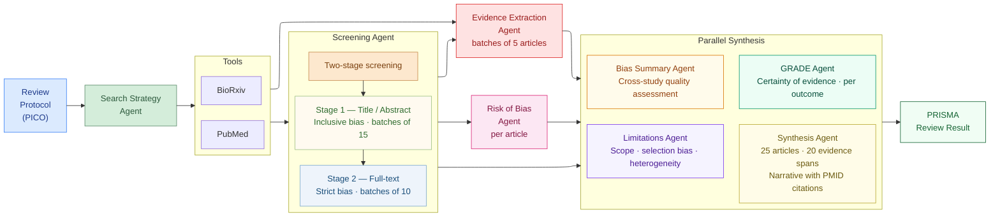

```mermaid
---
config:
  theme: mc
  layout: elk
---
flowchart LR
 subgraph TOOLS["Tools"]
    direction TB
        PubMed["PubMed"]
        BioRxiv["BioRxiv"]
  end

 subgraph SCREENING["Screening Agent"]
    direction TB
        SL["Two-stage screening"]
        S1["Stage 1 — Title / Abstract\nInclusive bias · batches of 15"]
        S2["Stage 2 — Full-text\nStrict bias · batches of 10"]
  end
    SL --> S1
    S1 --> S2

 subgraph PSYN["Parallel Synthesis"]
    direction TB
        SYN["Synthesis Agent\n25 articles · 20 evidence spans\nNarrative with PMID citations"]
        BIAS["Bias Summary Agent\nCross-study quality assessment"]
        GRADE["GRADE Agent\nCertainty of evidence · per outcome"]
        LIM["Limitations Agent\nScope · selection bias · heterogeneity"]
  end

    PROT["Review\nProtocol\n(PICO)"] --> SSA["Search Strategy\nAgent"]
    SSA --> TOOLS
    TOOLS --> SCREENING
    TOOLS --> EEA["Evidence Extraction\nAgent\nbatches of 5 articles"]
    SCREENING --> EEA
    SCREENING --> ROB["Risk of Bias\nAgent\nper article"]
    SCREENING --> PSYN
    EEA --> PSYN
    ROB --> PSYN
    PSYN --> RES["PRISMA\nReview Result"]

    PROT:::protocol
    SSA:::search
    SL:::header
    S1:::stage1
    S2:::stage2
    EEA:::evidence
    ROB:::rob
    SYN:::synth
    BIAS:::bias
    GRADE:::grade
    LIM:::lim
    RES:::result

    classDef protocol fill:#DBEAFE,stroke:#3B82F6,color:#1E3A8A
    classDef search   fill:#D4EDDA,stroke:#5A8A6A,color:#2D5A3D
    classDef header   fill:#FDE8CE,stroke:#C4884A,color:#7A4010
    classDef stage1   fill:#FFFAF0,stroke:#9DBF82,color:#2E6B2E
    classDef stage2   fill:#EEF4FB,stroke:#7BA8CC,color:#1A4E7A
    classDef evidence fill:#FEE2E2,stroke:#DC2626,color:#991B1B
    classDef rob      fill:#FCE7F3,stroke:#DB2777,color:#831843
    classDef synth    fill:#FFFCE8,stroke:#B8A830,color:#6B5A10
    classDef bias     fill:#FFFBEB,stroke:#D97706,color:#92400E
    classDef grade    fill:#ECFDF5,stroke:#059669,color:#064E3B
    classDef lim      fill:#F5F3FF,stroke:#7C3AED,color:#4C1D95
    classDef result   fill:#F0FDF4,stroke:#166534,color:#166534
```
