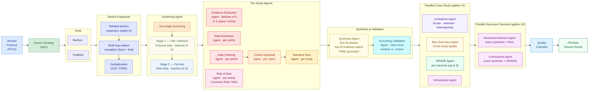

```mermaid
---
config:
  theme: mc
  layout: elk
---
flowchart LR
 subgraph TOOLS["Tools"]
    direction TB
        PubMed["PubMed"]
        BioRxiv["BioRxiv"]
  end

 subgraph EXPAND["Search Expansion"]
    direction TB
        REL["Related-articles\nexpansion (depth-N)"]
        HOPS["Multi-hop citation\nnavigation (back + fwd)"]
        DEDUP["Deduplication\n(DOI / PMID)"]
  end
    REL --> HOPS
    HOPS --> DEDUP

 subgraph SCREENING["Screening Agent"]
    direction TB
        SL["Two-stage screening"]
        S1["Stage 1 — Title / Abstract\nInclusive bias · batches of 15"]
        S2["Stage 2 — Full-text\nStrict bias · batches of 10"]
  end
    SL --> S1
    S1 --> S2

 subgraph PERSTUDY["Per-Study Agents"]
    direction TB
        EEA["Evidence Extraction\nAgent · batches of 5\n2–5 spans / article"]
        DEA["Data Extraction\nAgent · per article"]
        ROB["Risk of Bias\nAgent · per article\nCochrane RoB / NOS"]
        DCA["Data Charting\nAgent · per article"]
        CAA["Critical Appraisal\nAgent · per rubric"]
        NRA["Narrative Row\nAgent · per study"]
  end
    DCA --> CAA
    CAA --> NRA

 subgraph SYNTH["Synthesis & Validation"]
    direction TB
        SYN["Synthesis Agent\nfirst 25 articles\ntop 20 evidence spans\nPMID-grounded"]
        GV["Grounding Validation\nAgent · claim-level\nverdicts vs. corpus"]
  end
    SYN --> GV

 subgraph PAR1["Parallel Cross-Study (gather #1)"]
    direction TB
        BIAS["Bias Summary Agent\nCross-study quality"]
        GRADE["GRADE Agent\nper outcome (up to 3)"]
        LIM["Limitations Agent\nScope · selection · heterogeneity"]
        INTRO["Introduction Agent"]
  end

 subgraph PAR2["Parallel Document Sections (gather #2)"]
    direction TB
        CONC["Conclusions Agent\n(uses synthesis + GRADE)"]
        ABS["Structured Abstract Agent\n(uses synthesis + flow)"]
  end

    PROT["Review\nProtocol\n(PICO)"] --> SSA["Search Strategy\nAgent"]
    SSA --> TOOLS
    TOOLS --> EXPAND
    EXPAND --> SCREENING
    SCREENING --> PERSTUDY
    PERSTUDY --> SYN
    GV --> PAR1
    PAR1 --> PAR2
    PAR2 --> QC["Quality\nChecklist"]
    QC --> RES["PRISMA\nReview Result"]

    PROT:::protocol
    SSA:::search
    REL:::expand
    HOPS:::expand
    DEDUP:::expand
    SL:::header
    S1:::stage1
    S2:::stage2
    EEA:::evidence
    DEA:::evidence
    ROB:::rob
    DCA:::charting
    CAA:::appraisal
    NRA:::narrative
    SYN:::synth
    GV:::ground
    BIAS:::bias
    GRADE:::grade
    LIM:::lim
    INTRO:::doc
    CONC:::doc
    ABS:::doc
    QC:::quality
    RES:::result

    classDef protocol  fill:#DBEAFE,stroke:#3B82F6,color:#1E3A8A
    classDef search    fill:#D4EDDA,stroke:#5A8A6A,color:#2D5A3D
    classDef expand    fill:#E0E7FF,stroke:#6366F1,color:#312E81
    classDef header    fill:#FDE8CE,stroke:#C4884A,color:#7A4010
    classDef stage1    fill:#FFFAF0,stroke:#9DBF82,color:#2E6B2E
    classDef stage2    fill:#EEF4FB,stroke:#7BA8CC,color:#1A4E7A
    classDef evidence  fill:#FEE2E2,stroke:#DC2626,color:#991B1B
    classDef rob       fill:#FCE7F3,stroke:#DB2777,color:#831843
    classDef charting  fill:#FFE4E6,stroke:#E11D48,color:#9F1239
    classDef appraisal fill:#FFEDD5,stroke:#EA580C,color:#9A3412
    classDef narrative fill:#FEF3C7,stroke:#D97706,color:#78350F
    classDef synth     fill:#FFFCE8,stroke:#B8A830,color:#6B5A10
    classDef ground    fill:#CFFAFE,stroke:#0891B2,color:#155E75
    classDef bias      fill:#FFFBEB,stroke:#D97706,color:#92400E
    classDef grade     fill:#ECFDF5,stroke:#059669,color:#064E3B
    classDef lim       fill:#F5F3FF,stroke:#7C3AED,color:#4C1D95
    classDef doc       fill:#FAE8FF,stroke:#A21CAF,color:#701A75
    classDef quality   fill:#E0F2FE,stroke:#0284C7,color:#0C4A6E
    classDef result    fill:#F0FDF4,stroke:#166534,color:#166534
```
